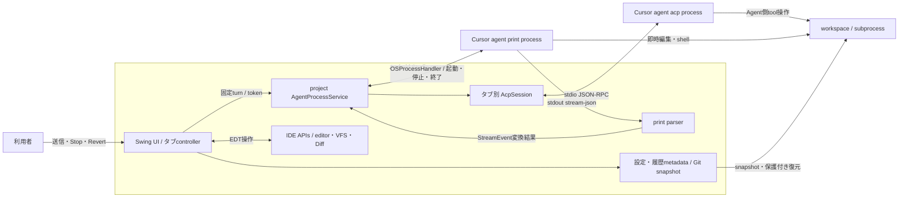
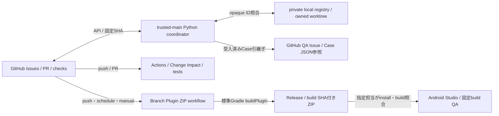

# 全体設計の入口

#227。構造の照合基準は develop `53813c2`（2026-09-12）。実装変更時は対象branch/SHAと本書の参照先を再照合する。進捗は[Project](https://github.com/users/shinma06/projects/2)、受入と担当は各Issue/PR、結果は[Case JSON](../verification/README.md)が正本であり、本書に状態を転記しない。

## 6観点の責務と変更先

6観点は同じシステムを見る切り口であり、6モジュールを新設する区分ではない。

| 観点 / 所在 | 入力 → 出力 | 判断・更新の所有者 | 変更時の検証 / 正本 |
| --- | --- | --- | --- |
| プロジェクト / GitHub | 依頼・受入 → Issue・依存・進行案内 | Issue writerが受入、PMが順序と派生表示を照合 | [作業管理](../development/work-management.md)、[終了時同期](../development/github-projects.md#issue終了時の整合確認)。Project=案内、Milestone=到達目標、native関係=実依存/分解 |
| 知識 / `CLAUDE.md`・`docs/` | 検証可能な根拠 → 方針・現行設計・判断 | 該当設計のwriter、別sessionが根拠と適用範囲をレビュー | [Mission](../project-mission.md)が目的、[ACP First](cursor-integration.md)が方針、[現行実装](current-implementation.md)が実装説明。経緯はIssue/PR、版付き実測はresearch/Case。昇格・履歴の扱いは[知識の正本](knowledge.md) |
| 製品 / `src/main/` | 入力・IDE context・Agent event → 表示・IDE操作・保存metadata | タブcontroller、project service、通信sessionがそれぞれの寿命を所有 | 下図と[現行実装](current-implementation.md)。token/EDT/復元・保存互換テストと変更Case |
| テスト / `src/test/`・`scripts/*/test_*.py` | 合成入力・採取fixture・固定build → 限定した証拠 | writerが適切な層を選択、独立reviewerが実経路と限界を確認、指定GUI担当が実観察 | [検証手順](../verification/README.md)。単体=状態、契約=parser/fake ACP、結合=service/listener接続、GUI=IDE操作と実Agent。[6安全条件の対応](../verification/lifecycle-contracts.md) |
| 開発運用 / `scripts/workflow/` | Issue/PR・trusted base・private登録 → 判定・GitHub更新 | PM/coordinatorがclaimと固定SHAを照合、独立sessionがレビュー | [PR自動進行](../development/pr-automation.md)、[GUI lease](../development/gui-coordination.md)。公開metadataとprivate registryを分離し、失敗は停止・再試行へ |
| ビルド・配布 / Gradle・`.github/workflows/` | source/SDK/依存 → Plugin ZIP | Gradleが生成、CIが検証、配布scriptがbranchとbuild SHAを照合 | [Change Impact](../development/change-impact.md)・[4実行経路](../development/tooling-boundaries.md)、[ZIP配布](../development/plugin-zip-delivery.md)。source HEAD、ZIPのbuild SHA、実ロードbuildは別々に確認 |

## 製品の外部関係と実行単位

[C4](https://c4model.com/introduction)の外部関係/実行単位を次の図に、[arc42](https://arc42.org/overview/)の責務・実行時・配置・品質の観点を表と後続経路に対応付ける。図は現行接続の概略であり、PMや文書をソフトウェア部品に見立てない。



MCP一覧の補助CLI操作は存在するが、PluginによるAndroid/MCP tool公開はこの図の実装済み接続ではない。ACPのfs/terminal client capabilityも未提供。正確な能力範囲は現行実装と[要件](../cursor-agent-plugin-requirements.md)へ進む。

### 送信 → 表示 → 停止 → 復元

1. [controller](../../src/main/kotlin/com/cursoragent/ui/AgentUiController.kt)がタブの入力・mode/modelを[SessionTabs](../../src/main/kotlin/com/cursoragent/session/SessionTabs.kt)のrun tokenへ固定。[service](../../src/main/kotlin/com/cursoragent/service/AgentProcessService.kt)の`prepareTurn`が[TurnWorkspace/TurnSettings](../../src/main/kotlin/com/cursoragent/service/TurnWorkspace.kt)と準備予約を保持する。現時点のACP設定事前検証はUIからAcpSessionを直接呼ぶ（#229の変更対象）。
2. EDTでeditor/VFS、背景でGit/checkpointを取得し、固定turnを送る。printはparser callback、ACPはtyped [AgentEvent](../../src/main/kotlin/com/cursoragent/service/AgentEvents.kt)を[listener](../../src/main/kotlin/com/cursoragent/ui/AgentTurnListenerFactory.kt)へ渡す。EDT上でtoken/generation/停止を再照合し所有タブだけを更新。print全文置換とACP deltaは現在別経路（#230）。
3. Stopは当該[AgentRun](../../src/main/kotlin/com/cursoragent/service/AgentRun.kt)だけを停止する。printのResult、ACP prompt終端、OS/観測child終了を同一にしない。closeはtoken無効化・detach・停止。別タブや後続runへ遅延イベントを渡さない。
4. [WorkspaceOperationGate](../../src/main/kotlin/com/cursoragent/service/WorkspaceOperationGate.kt)が準備/実行と復元を排他にする。不確定なACP終了、ISOLATED/由来不明root、後続編集・未保存内容は復元を拒否。判定の詳細は[復元契約](../development/restore-target-integration.md)。保存metadataは本文復元の保証ではない（#44）。

## Issue → PR → QA → 配布



[workflow](../development/github-workflow.md)に従いIssue claim→専用worktree→Draft PR→固定HEAD/baseレビューとrequired checks→develop統合→[qa_handoff.py](../../scripts/workflow/qa_handoff.py)の双方向readback→元Issue close。GUI/main未達はQAに残す。配布はpushでも起動し、PRのmerge/QA合格を配布条件と同一視しない。knowledge-only等のZIP省略は[classifier](../../scripts/workflow/change_impact.py)が決める。失敗/旧ZIPのSHAを現HEAD成功に書き換えない。main promotionは候補全体の別gate。

coordinatorのレビュー実行は[Codex実行規約](../development/codex-execution-policy.md)にも従う。ツール経由でもAstraの子Agent生成は許可されず、PAUSED heartbeatの自動再開もしない。

## 現状 → 目標 → 今回の適用

```text
変更前                         今回の目標 = 適用後
README.md（個別設計への案内）    README.md → docs/architecture/README.md
 docs/architecture/             docs/architecture/
  cursor-integration.md          README.md              # 全体の入口を追加
  current-implementation.md      cursor-integration.md   # 方針を維持
                                current-implementation.md # 実装を維持
src/main/・src/test/             同じ配置（専門Issueが変更の必要性を判断）
scripts/workflow/               同じ配置（4経路の検証は#232）
```

| 旧 → 新 / 編集範囲 | 今回の扱い・理由 | 担当Issue |
| --- | --- | --- |
| READMEの個別案内 → 本書の6観点入口 | 実際に置換。詳細の複製をせず到達経路を一本化 | #227 |
| PR templateの独立レビュー行 → 境界・正本更新確認を含む同じ行 | 既存レビューに統合。新gate/全体監査を追加しない | #227 |
| CLAUDE.mdの現行/履歴、architecture 2文書、#44/#141の現行入口 | 知識分類と採用条件、必要な配置変更は#228。今回移動しない | #228 |
| `ui/AgentUiController.kt`の設定検証 → service入口、`acp/`の防御 | 計画。公開入口の所有を見直す。保存型や本文IDを変更しない | #229 |
| `ui/AgentTurnListenerFactory.kt` / `service/AgentEvents.kt` / print parser | 本文契約と境界の変更または根拠付き分離維持。全イベント統一は前提にしない | #230 |
| `settings/ChatHistoryState.kt`等の本文保存・本文ID | #228はIssue案内だけ、#230はイベント意味だけ。保存型のwriterは#44 | #44 |
| `src/test/` / fixture / Case参照 | 6不変条件と証明範囲。#229/#230が触れたテストは統合後のSHAで再照合 | #231 |
| `scripts/workflow/` / CI / classifier / ZIP | 4経路とimport副作用を検証。実害がなければ既存再利用を維持 | #232 |

全体図のためだけに6フォルダや新Gradleモジュールを作らない。現在のpackage・XML登録・resources・標準テスト検出・hook/CLI入口を維持し、専門Issueで必要な移動が判明したときにその全参照とChange Impactを確認する。上表は担当範囲の設計であり、他Issueの未実装を完了扱いしない。

## 既存レビューでの使い方

境界・保存型・配置・設計を変えたwriterは該当行から正本と必要検証を選び、独立reviewerが固定HEAD/baseで追跡する。全体再監査は[既存の発火条件](../development/git-governance-audit.md)で判断。Project概要は短い段階案内と正本へのリンクにし、更新責任は[終了時同期](../development/github-projects.md#issue終了時の整合確認)に残す。

初回の経路確認は、独立reviewerが①設定拒否案内の製品変更、②設計説明の文書変更について、本入口だけから実装/更新先、担当境界、検証を回答しPRへ記録する。図の作成だけでは合格にせず、リンクとソースへの到達を確認する。次回変更の作業時間や品質改善は未測定。
