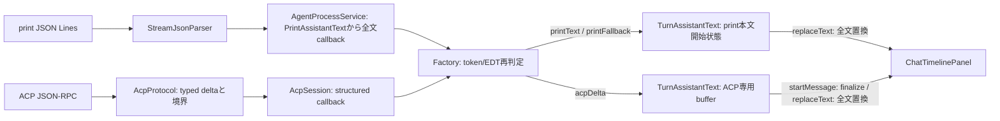

# printとACPのUIイベント契約

#230の基準: develop `91c428005505dda04a56c67601e736ac40dc5f8d`。AgentProcessListenerにprint個別callbackとACP typed eventが併存すること自体を不具合としない。通信ごとの意味を確認し、本文の縦の経路だけを直接テスト可能にする。

## 6種の契約と分離判断

| 種別 | print入力 → 正規化 → UI | ACP入力 → 正規化 → UI | 判断・未知/欠損 |
| --- | --- | --- | --- |
| 本文 | StreamJsonParser.AssistantDelta → service内PrintAssistantText → onAssistantTextの全文 → setAssistantTextで**置換**。Resultは本文未開始の時だけfallback | AcpProtocolのagent_message_chunk → AgentEvent.Text(text, messageId, startsMessage) → deltaを順に**追加**して全文をsetAssistantTextで**置換**。startsMessageで前bubbleをfinalizeしbufferをclear | アルゴリズムを分離維持。同文=重複と決めない。#254は実測CLI版・partial指定でdelta/flushを区別。未知版だけは従来heuristicを残す。ACPへdeduper/result補完を流用しない |
| 思考 | thinking/delta → onThinking → 短いstatus | agent_thought_chunk → AgentEvent.Thought → 短いstatus。protocolは次本文の境界を立てる | 表示はstatusで共通だが、ACP境界意味をprintへ推定移植しない。本文へ混ぜない |
| tool | ToolCallPayloadParser → started/completed callback → call IDの行置換。採取completed editのbefore/afterから事後Diff/Revert | AcpProtocolで部分fieldをmerge・明示array置換 → AgentEvent.Tool → structured card更新。session内call IDで追跡 | 共通化しない。ACP部分diffをprintの完全before/afterへ偽装しない。print started-field推測とcompleted採取を区別。ACP tool到達は次本文の境界になるが、printは既存同bubble全文置換を維持 |
| 要求返答 | headless即時編集。Pluginが事前書込承認を提供するcallbackではない | request method → AgentInputRequest → card → AgentAnswer。CAS/pending解放で一度返信、未知requestはprotocol error、通知に返信しない | ACP固有要求をprintへ仮設しない。ID/選択肢・対象欠損の拒否・Stop/close取消を保持。新要求はwire/入力/返答/未知処理を一緒に確認 |
| 終端 | Resultはusage/本文補完/エラー。OSProcessHandlerの終了→AgentRun.completeで終端 | prompt stopReason→AgentTurnOutcome、観測child静止/EOF不確定を区別→AgentRun。cancel応答だけで復元gateを開かない | provider終端、意図停止、OS終了、復元可否を単一completedへ統一しない。Runが一度の終端、UIがtoken/EDTを所有 |
| usage | Result.usage→TokenUsage→onTokenUsage→usage ticket付き既存context表示 | 現接続に実usage配線なし。確定configは別AgentEvent.Configuration | 欠損を0や推定消費へ変換しない。#149の実usage採用/受入を本Issueへ取り込まない |

未知/不正print JSONは既存parserが防御的に扱い、Unknownをデバッグ記録する。ACPはtyped変換前にpayload上限/必須field/JSON-RPCを検証し、未知notificationや未対応mediaを既知本文へ変換しない。現UI向けAgentEventにraw JSON/process handleを追加しない。

## 本文の変更前 → 目標 → 適用

以前はfactory.createのlocal変数と3 callback内に本文状態が分散していた。適用後は同じ `ui/AgentTurnListenerFactory.kt` 内のinternal `TurnAssistantText`へその状態と表示操作を移した。公開イベントの全種類を統一せず、printText/printFallback/acpDeltaを明示する。出力は全文のreplaceTextと、ACPだけが要求するstartMessage。factoryは既存timelineのsetAssistantText/finalizeAssistantMessageを渡す。

setAssistantTextが既にensureAssistantBubbleするため、print初回の二重ensure呼出しを削除した。service内のprint正規化・UIのfallback開始状態とACP bufferは別々で、turnごとに新しいstateを作る。Resultは物理終了でないため、fallback後にassistant deltaが来れば元通りdelta由来の全文で置換し、fallbackをdeduper bufferへ混ぜない。

#254ではprint正規化をserviceへ移し、UIは既に正規化された全文を表示・保存へ同時に渡す。ACP、tool/要求/終端/usage、保存DTOは維持する。二重deduper、version registry/cache、新依存は追加しない。

### #254 printの採用条件と失敗時の扱い

[公式Output format](https://cursor.com/docs/cli/reference/output-format)と[#116の公開実測](../research/issue-116-stream-json-contract.md)に従い、同じ実行ファイル・cwd・環境でturn開始時に`--version`を取得する（3秒上限、Stop/disposeで終了、取得失敗は未知版）。実測済み`2026.09.10-fd3934a`とそのturnの`--stream-partial-output`指定が揃うときだけ、timestamp_msのみのassistantをdeltaとして連結し、timestamp_ms + model_call_idのtool前flushと両方欠損のfinal flushを除外する。正当な同文・短文・改行・日本語・emojiはそのまま連結する。timestampは非負整数、model_call_idは空でない文字列を検証し、値そのものは保持しない。

同版の非partialはassistantの完全messageを順に連結し、flush filterを使わない。旧版・未知版・版取得失敗は従来のAssistantChunkDeduperを使う。既知partialのmetadataがnull/不正型/片側欠損など契約外なら、受信済み全文をseedにして従来heuristicへ一度だけ戻す。そのturn中は再切替しない。両field欠損は既知版のfinal形式と解釈するため、未確認版をこの経路に入れない。未知版や契約外入力の完全な復元を保証するものではなく、新版の採用には実測fixtureと回帰確認が必要。

stdout通知はJSON行の途中で切れ得るためparserが改行まで保留し、EOF時に末尾の完全JSONも配送する。不完全JSONは破棄する。Resultなしのエラー/EOFは受信済み本文を保ち、成功Resultだけの既存fallbackと物理終了を分離する。正規化はAgentRunの有効期間内、全文置換は既存token/EDT guard内で行う。Stop後・旧turn・別tabへ配信せず、同じ全文をConversationRecorderへ渡す。ACPは引き続き固有delta経路を使う。

## 検証と証拠の範囲

[TurnAssistantTextTest](../../src/test/kotlin/com/cursoragent/ui/TurnAssistantTextTest.kt)は実parser/protocolと、factoryが実際に使用する本文stateを通して、表示操作の文字列と順序を確認する。

| ケース | 期待する表示操作 / 証拠種別 |
| --- | --- |
| 未知版print累積再送、tool前後、Result | 合成JSONのHello→tool→Hello, world→同文再送→fallbackは、replace Hello / replace Hello, worldだけ。toolで未知の本文境界を発明しない |
| print本文なしfallback / 遅いdelta | result onlyを一度表示、重複fallbackは無視。後続late deltaはその全文で置換し、再fallbackで上書きしない。合成のcallback列 |
| ACP同文反復・tool/思考・ID境界 | 合成ACP messageId=aの「はい」「はい」は「はいはい」。tool/思考/ID変更後はstart→replaceを明示し旧本文を混ぜない。print deduperへ通していたら失敗する期待値 |
| 採取済みprint fixture | 04_plain_question_success.jsonl（Teams/CLI 2026.09.02-c22c1a3）のassistant OK二回＋Result OKはreplace OK一回。出所は [fixture README](../../src/test/resources/stream-json-fixtures/README.md)。合成/公開待ちACP wireへ名前を変えない |
| 遅延・別tab/旧token | 既存 [AgentTurnDispatchTest](../../src/test/kotlin/com/cursoragent/ui/AgentTurnDispatchTest.kt) が実factoryのguardとSwing EDTで、選択tabに関係なく所有tokenへ配送しclose/置換後を拒否。本文callbackも同じupdateを通ることをsourceレビューする |

実行は `./gradlew test --tests '*TurnAssistantTextTest' --tests '*AgentTurnDispatchTest'`、commit後 `python3 scripts/workflow/change_impact.py --base origin/develop --run-tests`、runtimeの `./gradlew buildPlugin`。既存deduper/parser/AcpProtocol/Run/復元/要求試験も標準JUnitで維持する。

テストの表示先は操作記録callbackであり、実timeline widget/IDEのpaint・focus・スクロール・実Cursor互換を証明しない。factoryのbindingは独立sourceレビュー、画面の文字欠落/重複/別tab混入は [issue-230.json](../verification/changes/issue-230.json) のTEXT-CONTRACTSで固定buildのQAへ引継ぐ。#146の公開待ち・QA #152/既存Caseの未達を維持する。

以後のイベント追加/変更ではwriterと独立reviewerが、wire種別→typed値→append/replace/境界→欠損/未知/終端の意味と対応テストを同じPRで確認する。停止・返答・復元は [6条件表](../verification/lifecycle-contracts.md)、根拠採用は [知識の正本](knowledge.md)から辿る。常設監視や全イベント一括移行は追加せず、実運用の改善効果は未測定とする。

#254の追加試験: Issue116PrintContractTestはtoolsの最終本文`START-A\nBETWEEN-BDONE-C 46`とResult一致、plainの40delta受信全文（exit 1であり成功12行を捏造しない）、非partialを検証する。PrintAssistantTextTest/PrintChunkTestは合成境界、PrintVersionProbeTestは使い捨て実プロセスの版取得・失敗・停止・timeout、PrintRecordingDispatchTestは実parserからguard・全文置換・保存再読込を確認する。画面/copy/保存の固定build受入は[issue-254.json](../verification/changes/issue-254.json)へpendingで引継ぎ、[QA #246](https://github.com/shinma06/cursor-in-android-studio/issues/246)のblockedBy #254を維持する。
