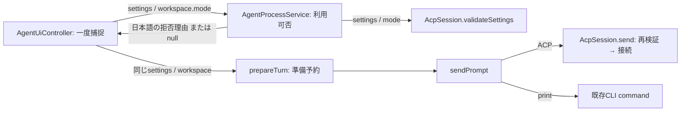

# 送信設定の検証境界

#229の基準: develop `33f9edcddd84df4032826e17deb87ba2ef92787f`。観測はUI→AcpSession.validateSettings/AcpExceptionの直接依存と、検証後にsettingsを再生成する経路。設定不具合が実ユーザーで再現したという主張ではない。

## 変更前・目標・実際の呼出し

| 段階 | 変更前 → 適用後 | 入力・出力 / 所有 |
| --- | --- | --- |
| UIの早期案内 | AgentUiController→AcpSession.validateSettings、AcpException catch → AgentProcessService.settingsUnavailableReason | transport・固定TurnSettings・固定workspace.mode → 日本語String?。非対応なら表示してreturn。入力消去/SessionTabs.beginTurn/準備予約より前 |
| 設定固定 | 検証用settingsとbeginTurn後の送信用settingsを別々に生成 → UIで一度生成し同じ参照をprepareTurnへ | executable/model/mode/permission/sandboxは不変TurnSettings。tabのchatIdと明示worktree modeからcaptureWorkspaceする。全application設定の原子的snapshotを新たに提供するものではないが、一度捕捉した値を後で読み直さない |
| workspace | captureWorkspace内でapplication設定を再読取 → mode引数を明示 | TurnWorkspaceのroot/mode/resume/来歴を固定し、実filesystemの解決は従来通りlazyな背景準備。早期案内はmodeだけを読む |
| 通信の防御 | AcpSession.send→validateSettings → 維持 | UIを経由しない送信にも同じ通信固有制約を適用。接続/設定/prompt開始より前に拒否しrunを終端。UI早期案内はこの防御を代替しない |

全呼出元を検索した結果、UIのsendPromptがsettings生成/captureWorkspace/prepareTurnの製品入口、サービスsendPromptがAcpSession.sendの製品呼出元。validateSettingsの製品呼出元はサービスの早期利用可否とAcpSession.sendの実行防御の2つ。例外型はacp/service内に留める。テストはこの意図的な二重防御をそれぞれ確認する。

UIはtabのsnapshotからtransport/chatIdを読み、同じEDT操作内でsettingsのmode/modelをSessionTabsへ反映してbeginTurnする。以後はtoken/generationで所有viewを判定する。今回の変更は入力消去や新runの開始位置を早めない。実行中の設定変更は既存turnの値に影響せず、次のturnで捕捉する。

## 維持する契約と配置

ACP固有の対応条件は既存validateSettingsが正本。既存enum/保存XML/既定permission、printのflag変換、ACP初回選択・会話中transport固定・失敗時非再送・復元排他を維持する。printの早期利用可否はnullで従来の設定を受け付ける。未知の新transportを登録する汎用registry/DIは不要。

実装配置は `ui/AgentUiController.kt` → `service/AgentProcessService.kt` → `acp/AcpSession.kt` を維持し、ファイル移動なし。serviceの既存入口に日本語理由の問合せを足し、UIのACP importを削除した。TurnSettings/TurnWorkspaceの保存型や既存package/登録XML/resource/Gradle設定は変更しない。テストはsource責務に沿い `service/AgentSettingsBoundaryTest.kt`へ追加する。全体のdirectory分割で解決すべき新しい依存は確認していない。

#141の段階移行の子Issue。親PM ownerと#146公開待ちを維持し、#44本文保存、#230本文イベント、#149usageを巻き取らない。

## 検証と次回レビュー

- [AgentSettingsBoundaryTest](../../src/test/kotlin/com/cursoragent/service/AgentSettingsBoundaryTest.kt)は実AgentProcessServiceをProject proxyで生成し、全permission/sandbox/worktree組合せのprint保持/ACP拒否、準備後のapplication設定変更でもsettings/workspaceの**同一参照**と値が維持されることを確認する。ProxyはSDK呼出しをbasePath等に限定し、不意の依存追加は失敗する。
- 同テストの `ACP execution rejects unsupported settings even without the early UI check` は実AcpSession.sendを直接呼び、早期案内を省略してもlaunch0回・日本語error1回・準備解放を確認する。合成の起動関数であり実Cursor接続ではない。
- `controller depends on service instead of ACP implementation` は当controller sourceのACP package直接参照を検出する小さい境界チェック。正当なIDE UI APIを禁止する全層lintではない。新たな迂回方法を全て検出する万能解析でもない。
- Stop後の遅いprocess attach/準備取消は既存AgentRunTest/WorkspaceOperationGateTest、ACP取消/child終了はAcpSessionTest、EDTの遅着拒否はAgentTurnDispatchTest。実経路と限界は [6条件表](../verification/lifecycle-contracts.md)。既存テストを複製しない。
- 実行: `./gradlew test --tests '*AgentSettingsBoundaryTest'`、commit後 `python3 scripts/workflow/change_impact.py --base origin/develop --run-tests`、runtime変更の `./gradlew buildPlugin`。標準JUnit配置で検出される。実IDEの入力保持/正常送信は [issue-229.json](../verification/changes/issue-229.json) のSETTINGS-BOUNDARYでpendingから記録し、既存ACP-SETTINGSも維持する。

設定・新transport・送信準備を変更するwriterと独立reviewerは、この呼出し表、早期拒否位置、固定snapshot、実行境界validation、停止/復元条件を同じPRで確認する。既存 [知識採用条件](knowledge.md)へ接続し、sourceと試験の限界を伴う現行制約だけを残す。実wire/GUIと本番不具合削減の効果は未測定。
