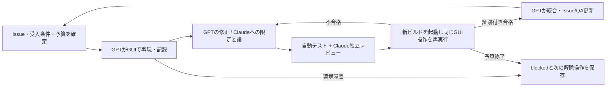

# GPT主導のGUIループエンジニアリング

> 2026-09-07 / #83: developはテスト・独立レビュー・Case追跡で統合可能（GUI pending/blocked/failを保持）。mainは固定候補全体の必要Case pass後のみ。区切り単位の入口は [確認マトリクス](../verification/README.md)。過去MV/runは履歴であり新候補のpassへ転記しない。

目的は、実画面で使う → 違和感を再現する → 小さく直す → 別の視点でレビューする → 同じ操作で改善を確かめる、を繰り返すこと。進捗の正本は [Issue #1](https://github.com/shinma06/cursor-in-android-studio/issues/1) と子Issue、GUI受入条件の正本は [QAマトリクス](../manual-verification/matrix.md)。この基盤は [#29](https://github.com/shinma06/cursor-in-android-studio/issues/29) で整備した。

**先に[GitHub開発規約](../development/github-workflow.md)と[GUI予約手順](../development/gui-coordination.md)を読む。**
Gitへの言及がない修正もIssue/専用worktree/PRが必須。GUIはqueueとホスト共通lease取得後のみ実行する。

## 役割と担当範囲

| 担当 | 主な責任 | 受け渡す成果 |
|---|---|---|
| GPT（ChatGPTアプリ / Codex） | 進行役、Issue選定とclaim、実装、統合、Computer UseでのGUI操作、証跡評価、再検証、GitHub PRのmerge | 対象SHA、受入条件、変更、証跡、次の一手 |
| Claude Pro | 独立レビュー、再現条件の穴・回帰・設計の指摘。GPTが切り出した実装だけ個別checkoutで担当可 | 重要度、ファイル/箇所、再現条件、影響、修正案。未実施のGUIをpassにしない |
| Cursor Pro | GPTがGUIから依頼する小さな作業を実施。Cursor IDEはUXの比較対象、Android Studio内のCursor Agentは製品検証対象 | 実際の応答、編集、ツールカード、停止/復元時の挙動 |
| 人間 | 目的・優先度の決定、ログイン/OS権限、GUI操作の引継ぎ、主観的な使いやすさの最終評価 | 必要な環境解除、期待UX、採用判断 |

Cursorを単なるCLIテスト要員にしない。GPTが入力・候補選択・送信・Diff・RevertまでGUIで操作し、Cursorが作業する過程のUXを観察する。CLIはバージョン・ログ・ディスク結果の補助確認に使う。

**実装はIssue/worktreeごとに並列、GUI操作だけホスト単位で1担当。** GPT/Claude等の実装担当は
専用branchからPRを作り、GPT進行役がレビュー済みPRをGitHub上で統合する。mainへの直接commit/pushは禁止。
GUI待ちの間も他担当の実装・テスト・レビューは続ける。レビュー担当はソース/GUIを変更しない。

## 1サイクルの流れ

1. `AGENTS.md` → 要件 → Issue #1 → 対象Issueのコメントを読む。`git status`、`git fetch origin`、`git log HEAD..origin/main`で同期を確認する。既存の未コミット変更を勝手に消す/stashする/pullに巻き込むことはしない。今回の変更と無関係なら保持し、重なる箇所だけ必要時に確認する。
2. 専用worktreeとPRを使い、対象Issueに `Starting loop: owner=GPT; scope=…; base=…; GUI=GPT; reviewer=Claude; budget=…` と記録する。完了・引継ぎのない他担当のclaimがあれば同じ範囲を開始しない。時間経過だけでclaimを奪わない。
3. 1回の対象を1つのUX問題と対応するMV IDに絞る。[シナリオ](scenarios.md)から選び、初期状態・期待結果・許可された編集先を固定する。標準予算は **45分、修正3回、Cursor送信8回**。これは運用上の上限で、スクリプトが自動強制するものではない。ユーザー指定を優先する。
4. GUI依頼票をIssueへ登録し、指定GPTセッションがホスト共通leaseを取得してからComputer Useで実行する。操作前の対象アプリ/ウィンドウ/fixtureを確認し、操作後の画面とAX（アクセシビリティ情報）を読む。古い要素番号や推測した座標を使い回さない。クリックが無反応なら最新AX→スクリーンショット→確認した座標の順で一度試し、取得失敗が続くなら停止する。
5. GPTが最小修正を実装し、必要な単体テストを追加する。Claudeには[レビュー依頼](prompts/claude-review.md)を渡す。Claudeの返答をGPTが評価し、採用/非採用の理由を記録する。レビューだけなら追加の実装claimやpushは不要。
6. `./gradlew test buildPlugin`を実行し、GUI予約を取得した担当だけが対象ビルドを新しくインストール・再起動する。[実行記録](evidence.md)にSHA・ZIPハッシュ・ロードした実体の証拠を残す。同じ操作と影響する隣接ケースを再実行する。
7. GPTが証跡を確認し、合格した範囲だけmatrixを更新する。`finish-work`でテスト、同期、task branchへのcommit/push、PRレビュー/merge、Issue更新を行う。機能の実装とGUI検証の完了は分ける。次の優先Issueと未解除ブロッカーを残す。

## 止める条件・再開

| 状況 | 判定と再開点 |
|---|---|
| 画面が取得できない、ログイン切れ、CLI認証失敗、IDE未起動 | `blocked`。エラー、最後の操作、未送信/実行中の有無を記録。修正やpassで代替しない |
| Cursor/Claudeの利用上限 | 該当役割を`blocked`。追加課金・APIへの自動切替をせず、GPTは独立して進められる修正/テスト/文書化を継続。Claudeレビュー未了を明示 |
| 期待と実画面が違う | 製品`fail`。期待/実際/再現率/証拠をIssueへ。Cursor側の挙動差はそのままプラグインの仕様にしない |
| 許可外のファイルへ変更、予期しない外部操作、復元先不明 | Stopし実際の差分を確認。失敗原因が分かるまで送信を繰り返さない |
| 予算上限、同じ修正を繰り返して改善なし | 現在の証拠を保存し、対象を分割するか次の一手を人間へ引き継ぐ |

再開時は記録の `next_action`、Issueのclaim、HEAD、起動中ビルド、fixtureの差分を再確認する。以前のGUI要素番号や古いpassは引き継がない。修正後の再検証は新run IDを作り、前runをリンクする。GUI leaseのtoken/期限と最新Issueも確認する。プロセス停止は対象を特定して実施し、全IDEや全agentプロセスの一括killはしない。

## 契約プランで使う経路

- GPT: 現在のChatGPTデスクトップアプリでComputer Useを利用する。この環境ではツール名/内部IDがCodexでも、UI表示名はChatGPT。対応アプリの確認は実ツールで行う。[公式Computer Use](https://learn.chatgpt.com/docs/computer-use)
- Claude: Claude ProのClaude.aiログインでClaude Codeを使える。APIキーの課金経路は別。まず`claude auth status`を確認し、未ログインならデスクトップアプリの既存ログインを使った新規レビュー会話、または人間がCLIにログインする。CLIとデスクトップの認証状態を同一と仮定しない。[公式認証](https://code.claude.com/docs/en/authentication)
- Cursor: ProにログインしたCursor IDE、およびログイン済み`agent`を呼ぶプラグイン。IDEのUI結果とheadless CLIの対応可否を分ける。[公式CLI](https://cursor.com/docs/cli/using)

APIキー、独自OAuth抽出、外部オーケストレータは不要。モデル名は実行時の選択値を記録し、固定した最新モデルや無制限利用を前提にしない。利用上限は各アプリの表示を確認する。

## 入口

- 人間が実行する: [human-runbook.md](human-runbook.md)
- GPTに1ループ依頼する: [prompts/gpt-loop.md](prompts/gpt-loop.md)
- Claudeへレビューを渡す: [prompts/claude-review.md](prompts/claude-review.md)
- CursorへGUIで課題を渡す: [scenarios.md](scenarios.md)
- 証跡形式・コマンド: [evidence.md](evidence.md)

これはセッションごとの継続開発手順。時刻指定の常駐処理や無限の自動再送は作成しない。定期実行を後から依頼された場合はアプリのスケジュール機能を使い、GUI占有・起動状態・予算・停止条件を指定する。
