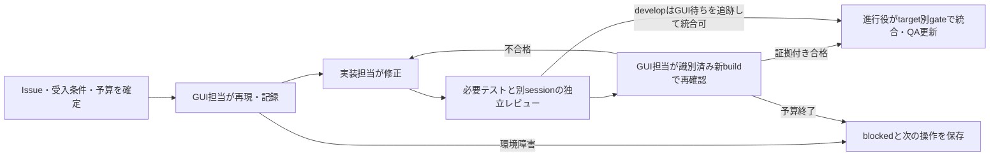

# 実画面の証拠を使うGUIループ開発

実画面で再現する → 小さく直す → 別sessionでレビューする → 同じ操作で改善を確認する、を繰り返します。進捗は対象Issueと[Project](https://github.com/users/shinma06/projects/2)、受入条件と候補結果は[Case JSON](../verification/README.md)を正本にします。旧MV/runは履歴であり、新候補へpassを転記しません。この基盤の導入は[#29](https://github.com/shinma06/cursor-in-android-studio/issues/29)、二段階統合は#83によります。

## 担当と適用条件

[GitHub開発規約の役割条件](../development/github-workflow.md#正本と役割)に従い、GPT/Codex・Claude・Cursorのいずれも開発を担当できます。必要な能力・実tool・許可・claimで選び、3者の併用は必須にしません。独立レビューはwriterと別sessionで行います。GUI操作は[ホスト共通lease](../development/gui-coordination.md)を得た対応可能な指定担当、または人間への引継ぎで行います。GUI toolがなければGUIだけを引き継ぎ、未確保ならblockedを記録します。

Cursor IDEはUXの比較対象、Android Studio内のプラグインは製品検証対象です。fixture内だけの編集制限はこの試験への入力に適用し、開発担当としてのCursorを制限しません。CLIによる版・ログ・ディスク確認は画面観察を補助します。GUI待ちでも別worktreeの実装・テスト・レビューは進められます。

## 1サイクルの流れ

1. [開始手順](../development/github-workflow.md#開始)に従い、対象Issueの全コメント・claim・Project・意図したbaseと作業treeを確認します。既存の編集を保持し、専用branch/worktreeとPRを使います。
2. 公開可能な担当IDで `Starting loop: owner=<writer>; scope=…; base=…; GUI=<operator or pending>; reviewer=<separate session or pending>; budget=…` を記録します。未解放claimを時間だけで奪いません。host・絶対パス・tokenはprivate registryだけへ保存します。
3. 1つのUX問題と対象Caseに絞り、[シナリオ](scenarios.md)のMV IDを必要なCaseへ対応付けます。初期状態・期待結果・許可された編集先を固定します。標準予算は**45分、修正3回、試験対象への送信8回**です。保存キー`max_cursor_sends`は維持します。これは運用上の上限で、スクリプトは自動強制しません。ユーザー指定を優先します。
4. GUI依頼票を登録し、指定担当がleaseを取得してから実行します。操作前に対象アプリ・ウィンドウ・fixtureを確認し、操作後に実画面と利用可能なAX情報を読みます。古い要素番号や推測座標を使い回しません。クリック無反応時は最新AX→スクリーンショット→確認した座標の順で一度試し、取得失敗が続けば停止します。Computer Use必須Caseは手操作で代替しません。
5. 実装担当が最小修正と必要テストを行い、[独立レビュー依頼](prompts/claude-review.md)を別sessionへ渡します。指摘の採否と理由を記録します。レビュー役は変更・GUI操作をせず、固定HEAD/baseを確認します。
6. 製品GUIを再確認する場合は[現行build手順](../../CLAUDE.md#開発検証の入口)に従って`test buildPlugin`を実行し、leaseを持つ担当だけがinstall・再起動します。[実行記録](evidence.md)にSHA・ZIP hash・ロード実体を照合した証拠を残し、同じ操作と影響する隣接Caseを再実行します。通常の文書変更は[Change Impact](../development/change-impact.md)の検証で進めます。
7. 実際に観察した範囲だけCase結果へ記録し、[finish-work](../../.agents/skills/finish-work/SKILL.md)へ進みます。developは必要テスト・独立レビュー・全Case追跡があればGUI pending/blocked/failを保ったまま統合できます。main promotionは固定候補全体の全必要Caseが同じbuildでpassした後です。未実装受入・残QA・main反映・次の担当を残します。

## 停止と再開

| 状況 | 判定と再開点 |
| --- | --- |
| 画面取得不能・認証切れ・IDE未起動・対応GUI担当未確保 | GUIをblockedにし、最後の操作・未送信/実行中の有無・解除担当を記録する |
| 選んだクライアントの利用上限 | 該当作業をblockedにする。追加課金やAPIへ自動切替せず、独立して進められる実装・テスト・文書化を継続する |
| 期待と実画面の不一致 | 製品failとして期待/実際/再現条件/証拠を専用修正Issueへ渡す。比較対象の挙動をそのまま仕様にしない |
| 許可外変更・予期しない外部操作・復元先不明 | Stopし差分を確認する。原因不明のまま再送しない |
| 予算上限・同じ修正で改善なし | 証拠を保存し、分割または次の操作を引き継ぐ |

再開時は`next_action`、claim、HEAD、ロードbuild、fixture差分、lease token/期限を再確認します。修正後は新run IDを作り、前runをリンクします。古いGUI要素番号やpassを引き継がず、停止するプロセスを特定します。全IDE/agentの一括killはしません。

## 利用する環境と入口

選んだ開発クライアントに必要なtool・権限・認証を確認します。全providerの契約やログインは前提にしません。製品試験では必要なCursor IDE/CLIの認証を別途確認し、IDEとCLIで同じ状態とは仮定しません。モデルの実際の選択値・利用上限を確認し、秘密情報を抽出・公開しません。自動連携の範囲は[PR automation](../development/pr-automation.md)に従います。

- [人間向けの開始手順](human-runbook.md)
- [開発担当への1ループ依頼](prompts/gpt-loop.md)
- [別sessionへの独立レビュー依頼](prompts/claude-review.md)
- [製品GUIへ渡す試験課題](scenarios.md)
- [証跡形式とコマンド](evidence.md)

promptの旧ファイル名はリンク互換のため残しています。セッションごとの継続開発手順であり、常駐処理や無限再送を追加しません。定期実行が依頼された場合は、利用環境の対応機能・GUI占有・予算・停止条件を確認します。
