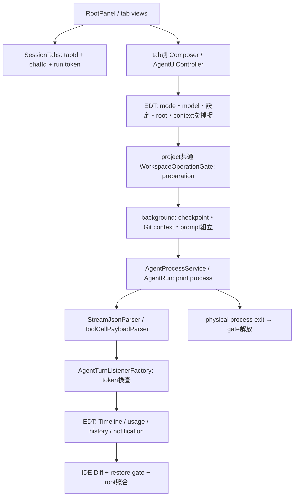

# ACP First: 全機能分類と段階的移行契約（2026-09-09 / #115）

本Pluginの主要な対話・状態通信をACPへ移し、IDE内の表示・安全な復元・Android固有情報はClientが所有する。CLIのモデル/MCP管理やGit操作は、公開ACP契約で置換できた部分から減らす。採用方針は決定済みだが、**この文書は設計・調査の完了であり、ACP製品実装やGUI合格ではない**。

親 [#141](https://github.com/shinma06/cursor-in-android-studio/issues/141)、既存調査親 #25/#19。Context更新 [#142](https://github.com/shinma06/cursor-in-android-studio/issues/142)のdevelop統合後に基準を固定した。既存Context・要件・製品コードは本Issueで変更しない。

## 1. 判定の読み方と固定した証拠

| 層 | 今回確認した範囲 | 意味しないこと |
|---|---|---|
| 方針 | ACP標準 → Cursor拡張 → IDE APIs → MCP → CLI → 非構造出力解析。IDE情報は直接APIを使える | ACPの全機能が利用可能、CLIを全廃 |
| 安定標準 S | ACP repository `ecd8d72bb67454f278c43fee94965a30e23b845f` の `schema/v1/schema.json`、schema package `1.21.0`、`meta.json` | `protocolVersion: 1`だけで全任意機能が使える |
| 未安定 U | 同SHAの `schema/v1/schema.unstable.json`との差分、draft/RFD | Cursor実装への送信許可、互換性保証 |
| Cursor公開 E | 2026-09-09のACP・JetBrains・SDK Bridge公式資料 | 掲載例が完全な実装、全設定・全拡張の広告/動作保証 |
| 広告/実測 L | 2026-09-08、CLI `2026.09.02-c22c1a3`、既存#114/#115の限定確認 | new/load/prompt・画像解析・承認・質問の成功 |
| 製品 P | develop `8aa71a8fb38edf45fe0f22eaf8b7da3e0194d432` のsource/callsite、下記の36要件と独自機能 | main反映、GUI合格 |
| QA Q | 既存 `docs/verification/changes/issue-*.json` を保持。今回の成果は文書のみ | 過去buildのpassを新ACP buildへ転用 |

固定標準: [stable schema][schema] / [unstable schema][unstable] / [method一覧][methods] / [package版][schema-version]。標準サイトにはv2も存在するが、今回のCursor広告はv1なのでv2のprompt lifecycle等を混在させない。schema package版とwireのprotocolVersionは別の値である。

既存限定実測は `initialize` 成功、`loadSession=true`、prompt `image=true/audio=false/embeddedContext=false`、`sessionCapabilities.list={}`、MCP `http/sse=true`。対象project cwdの `session/list` は `sessions=[]`、nextCursorなしだった。空一覧はtitle・本文・既存chatIdとの対応を証明しない。認証変更、new/load/prompt、課金推論、GUIを今回実行していない。詳細は[日付付き比較表](cursor-agent-capability-matrix-2026-09-08.md)と[#115の限定実測](https://github.com/shinma06/cursor-in-android-studio/issues/115)を正本とする。

分類は機能の主責務を示す。**A**=ACPへ原則移行、**B**=ACP対話＋CLI補助、**C**=CLI処理を維持、**D**=IDE API/Client責務として維持・改善。Dには既にIDE実装済みの表示・ローカル状態も含め、「今からCLIを置換する」とは限らない。未実装/非目的の項目にも候補分類を付けるが、それだけで実装scopeを追加しない。

## 2. 現行の実際の呼出経路

以下は定義だけでなくproduction callsiteを追った結果。テストからしか呼ばれていない機能はUI実装済みに数えない。参照リンクは固定develop。

| 経路・所有者 | 実装/呼出元 | 移行で保持・修正する境界 |
|---|---|---|
| 登録→tab view | [plugin.xml][src-plugin] → ToolWindowFactory → [RootPanel][src-root]。CardLayout内にtab別Composer/Timeline/Controllerを保持 | Tool Window/notification ID、PluginBrand、tab切替時のdraft/caret/scrollを保持。viewを再生成して消さない |
| UI state | [SessionTabs][src-tabs]。Rootからnew/open/select/close、ControllerからbeginTurn/bind/finish | plugin UUID tabId、provider chatId、turn tokenは別。同chatIdのtab重複を拒否。`rename`/`applyAutomaticTitle`はproductionから未接続、#66のNew Agentを保持 |
| 送信・設定 | [Controller][src-controller] → `SessionTabs.beginTurn` → `captureWorkspace`/`prepareTurn`。mode/modelはtab、permission/sandbox/path等はapp設定 | EDTでimmutable設定を捕捉、途中の設定変更で実行中turnを書き換えない。実行中inputは編集可、送信は抑止。queue未実装 |
| prompt context | [PromptContextBuilder][src-context] → [MentionResolver][src-mention]。active file/selection・VFS・TerminalはEDT側、Git diff/branchはbackground側 | 未保存DocumentとVFS内容は同一ではない。ACP導入だけで未保存全文注入済みにしない。`@Docs/@Web`はhint、`@Chats`は未接続 |
| root/復元排他 | [TurnWorkspace][src-workspace]、[WorkspaceOperationGate][src-gate]、SessionWorkspaceHistory、RestoreTarget/RestorePolicy | project共通gateは複数prepare/processを追跡し復元を排他。prepare終了だけでなく物理process終了まで予約保持。unknown/ISOLATED/root差替えを拒否 |
| transport | [AgentProcessService][src-process] → GeneralCommandLine/OSProcessHandler、[AgentRun][src-run] | per-tab実行可能なruns集合。`agent -p --output-format stream-json --stream-partial-output --trust`、cwd/workspace/resume/mode/model/権限等を捕捉。現在は1 turn=1 processであり、provider sessionは複数processに跨る |
| line→event | [StreamJsonParser][src-parser] → [ToolCallPayloadParser][src-toolparser] | malformed/unknownを防御。stdout callbackの`lineSequence`処理はACPのmessage framingとして流用しない。started payloadは独立live fixture未確認。stderrは診断用 |
| event→UI | [ListenerFactory][src-listener] → EDT token/generation検査 → [Timeline][src-timeline] | print deltaはAssistantChunkDeduperで全文へ変換。ACP deltaは別経路。tool rowsはcallIdで照合するが現APIはstarted/completed中心で、部分更新/複数contentは未対応 |
| usage | result→TokenUsage→ContextUsageState/View | 直近turnの入力/出力/cache counters。context使用率やアカウント利用枠ではない。旧turnの遅着をgenerationで排除 |
| 停止/close | Composer→Controller.stop→AgentRun.stop。tab closeは対象のみdetach/stop。project disposeは全run停止 | stop前のprocess未attach、終了との競合、listener detachを区別。UI消去やcancel送信だけを実処理停止としない |
| 個別Revert | ListenerFactory→DiffViewerHelper→FileRevertOperation、project restore gate | IDE未保存変更・after不一致・root不明・root外/.git/symlink escape拒否。ACP diffも同じ検証を通す |
| checkpoint | Controller→[CheckpointService][src-checkpoint]→[GitSnapshotStore][src-git]。ユーザーメッセージrollback actionからrestore | `stash create`/HEAD、`checkout sha -- .`、後発untracked削除。元untracked本文は保存しない、新規staged fileは残る。15日pruneはmetadataでありGit object保全を保証しない |
| history | ListenerFactory→ChatHistoryState、Header→PastChatsCoordinator→Root.openSession | project永続はchatId/冒頭120字/時刻だけ。本文・archive・検索/exportは未実装。SessionWorkspaceHistoryはメモリでlegacy rootを推定しない |
| metadata処理 | Controller→`listModels`→ModelListParser→[ModelFamilies/Selector][src-model]。Header options→McpServersDialog→`listMcpServersRaw/setMcpServerEnabled` | model suffix推測はexact IDを保持する限定heuristic。取得失敗と空一覧の区別は#43。MCPは`id: status`行解析とenable/disableのCLIで、ACP session状態とは別 |
| native表示 | MarkdownRenderer/MessageTextPane、SelectorPopupController、GrowingPromptField、SessionTabStrip、AgentNotificationService | 幅追従・日本語・IME/keyboard/focus・Unicode省略・optional Terminal依存を維持。ACPはこれらのUI品質を自動提供しない |

監査再現: `rg --files src/main/kotlin` と、上記クラス/公開関数名の `rg -n` を `src/main` と `src/test` に別々に適用。`parseLine`、`dedupe`、`prepareTurn`、`captureWorkspace`、`listModels`、`listMcpServersRaw`、`setMcpServerEnabled`、`restoreResult`、`revertFileContentResult`、`rename`、`applyAutomaticTitle`の全参照を照合した。製品コードの未知のACP実装を仮定していない。

## 3. 通信・状態の契約台帳

以下のK番号を機能表から参照する。Sは固定stable schema、Eは[Cursor ACP資料][cursor-acp]。**全KでPlugin ACP実装とGUI受入は未実施**。Lが空でも公開仕様を否定せず、live Caseで接続範囲を決める。

| K | 公開契約と構造化データ | Cursor広告/実測・未確認 | 採用判断 / 削除・UI改善 |
|---|---|---|---|
| K01 接続 | S initialize/authenticate、JSON-RPC request ID、capabilities。E `agent acp` stdio newline JSON、stderrログ | 既存initializeのみ成功。auth method `cursor_login`。版更新後の広告は取り直す | RPC request/response/notificationを別処理。利用不能versionは切断。認証は既存CLI資格情報の経路を使い、prompt/環境/鍵をログへ出さない |
| K02 turn/stream | S `session/prompt`→`session/update`のmessage/thought chunks→prompt responseのstopReason。任意messageId | prompt未実測 | chunkを順序通り追記し、print用重複推測とresult本文fallbackをACPから除去。messageIdはopaque、欠落許容。JSON RPC IDはCursorのサポート用request IDではない。[prompt仕様][prompt] |
| K03 tool | S tool_call/tool_call_update、toolCallId、kind/status、content/location、任意rawInput/rawOutput。更新は部分的、content/locationは置換 | Cursorの実payload/分割/順序、並列tool未確認 | (connection, session, callId)でupsert。`pending/in_progress/completed/failed`を表示、単なるpendingを承認待ちと決めない。rawOutputをshell固定schemaへ強制しない。[tool仕様][tool] |
| K04 permission | S session/request_permissionは返信必須request。optionsにopaque optionIdとkind、selected/cancelled outcome | Eはallow-once/allow-always/reject-onceを例示。実際のoptionId・policy保存範囲未確認 | 提示されたIDだけを返信。UIに対象/影響/日本語説明、拒否/取消。既存権限設定との意味を保持し、全toolが必ず事前確認されるとは約束しない |
| K05 config/mode/model | S session/new/loadのconfigOptions、set_config_optionとconfig_option_updateは**全設定リスト**。select/boolean、categoryは表示hint。従来modes/set_mode/current_mode_updateもS | Eのagent/plan/askとJetBrains model pickerは公開。CursorのconfigOptions・exact catalog・反映時点は未実測 | configOptionsがあれば優先しmodesと二重送信しない。全リスト置換で依存optionを更新。CLI alias suffixからmodel能力を推測する必要を削れる。`session/set_model`は今回の固定S/U method一覧にないため採用しない。[設定仕様][config] |
| K06 session/history | S new、loadSession条件のload、list capability条件のlist（cwd/cursor/任意title）、session_info_update。resume/close/deleteも個別capability条件 | list広告/空一覧だけ実測。load replay・title・legacy chatId互換、resume/close/delete広告なし | loadは全履歴updateの再生完了後に応答、resumeは本文再生なし。一覧・再生・永続保存を別機能にする。provider rename/archive RPCは固定Sにない。#66は実title取得まで維持。[setup][setup] / [list][session-list] |
| K07 cancel/error | S session/cancel通知、元prompt応答cancelled。取消中も通知/permission requestが到着し得る。汎用`$/cancel_request`は任意対応で別契約 | 取消後の書込み停止・子処理/切断・拒否・再接続は未実測 | `cancelling`を保持しpromptのterminal responseとClientが所有するwrite/tool完了を待つ。timeoutは成功へ変えず切断・不確定状態。無断prompt再送なし。[prompt取消][prompt] / [一般取消][cancellation] |
| K08 plan/todo | S plan notificationはentries/content/priority/statusの状態表示。Uには新plan_update等。E create_planはblocking request、update_todosはmerge指定notification | Eのnotification節にResponse型も併記され不整合。全体wire未実測 | 標準Plan表示と承認を別扱い。Cursor plan accept/reject/cancelを返す。TodoはIDでmerge/replace。通知に承認返信を作らない。計画Markdown編集を自動的にserverへ反映できるとはしない |
| K09 question | S elicitation/create（form/url）・completeが現在stable、clientがmode別advertise。E ask_questionはblocking、question/option ID・複数選択可 | CursorがS elicitationを送る証拠なし。Eはanswered/skipped/cancelled、自由文answer契約なし | 標準が実用可能なら優先、現Cursor候補は専用extension。decline/skip/cancel/遅延を区別。既存の「作業継続中に質問できる」と同等な非blocking性を約束しない。[elicitation][elicitation] |
| K10 context/usage | S usage_updateのused/sizeは現在context、costは任意累積。U PromptResponse.usageのinput/output/cache/thought等は別 | Cursor usage_update/詳細内訳未実測。print result countersの既存fixtureのみ | 本文/ファイル/category占有率を捏造しない。context率はsize>0かつ妥当なused時のみ、直近tokens/cost/account quotaと分ける。未知は不明のまま。[stable][schema] / [U][unstable] |
| K11 content | S text、image/audio、embedded resource、resource_link。promptのimage/audio/embeddedは広告条件 | image広告true、audio/embedded false。画像解析とplugin添付UIは未検証 | imageのMIME/サイズ/取消/一時ファイル寿命を管理。embedded不可なら現行の明示text contextを保つ。URIだけで未保存全文が届くとしない。[content][content] |
| K12 IDE callbacks | S fs/read_text_file・write_text_file、terminal create/output/wait/kill/release。Client advertiseした分のみ要求可 | 現CursorがどのtoolでClient callbackを使うか不明。falseはAgentの自前shell/fs禁止を意味しない | 最初はfs/terminal false。後にDocument/VFS/Executionへ接続、未保存とディスク競合/root/停止を管理。terminal trueは全methodの寿命/UTF-8上限処理まで実装後。[fs][fs] / [terminal][terminal] |
| K13 MCP | S new/load/resumeのMcpServer設定、stdio必須・http/sse任意capability。E project/user config、Team dashboard MCP非対応 | http/sse広告true。注入serverと既存configの重複/優先・認証/動的変更は未実測 | AgentがMCP client、IDEは必要時MCP server。既存serverを先に再利用。ACP標準はCursorの永続MCP一覧/toggle管理ではない。session再作成が必要ならturn間に明示 |
| K14 commands/skills | S available_commands_updateとprompt内slash command。E/CLI Skills/headlessは公開済み | Cursor広告内容・sticky mode・`/summarize`効果未実測 | `/`候補はserver提示値で置換/削除、`/skill`文字列とmode切替を混同しない。U compaction_update等は今回採用しない。[commands][commands] |
| K15 task/image extension | E task/generate_imageはnotification。taskはtoolCallId/subagentType/任意agentId、imageは任意path等 | Response型併記、task開始/終了の完全性、extensionのsession紐付けが未確認 | 最初は1 connection=1 sessionで紐付けを明確化。親子停止/usage合算やClientによる子spawn/画像生成要求とはみなさない。画像は検証済みscope内実ファイル/返されたcontentだけ表示 |
| K16 sandbox/worktree/CLI | 固定SにCursor sandbox policy、-w作成/復元root、CLI管理一覧を置換する汎用RPCなし | print flags実装済み。root flagsが`agent acp`へ同義適用されるか未確認 | flagsは検証済み経路に限定。ACP送信失敗後printへ自動再実行しない。ACPで選択設定を保証できない場合は送信前に説明して停止/ユーザー選択、黙って緩めない |

標準の未知通知は状態を壊さず無視・回数制限診断、未知requestはIDを保ったmethod-not-found等の明示errorを返す。既知Cursor blocking requestは未対応なら無限待ちにせず契約のcancel/rejectか対応不能errorを返す。通知にIDがなければ返信しない。公開例のtruthyな`msg.id`判定は流用せず、ID `0`、string ID、result `null`、error、重複/未知responseを区別する。

## 4. 要件36件のA〜D分類

各行のKは構造化契約・根拠・未検証を、Tは§8の移行Caseを参照する。Aは原則移行対象だがKの未確認を合格扱いにしない。現状の「実装」は固定developでのsource上の意味。

| ID / 機能 | 現状・主分類 | ACPで変える部分 / 残す部分・UI効果 | 契約 / Case / 依存Issue |
|---|---|---|---|
| F-01 テキスト送信 | 実装、A | CLI argv promptからsession/promptのtextへ。context組立とtabのimmutable設定は保持 | K01/02/05、T01/02/05、共通layer→#24 |
| F-02 streaming | 実装、A | ACP chunksを直接蓄積、全文UI更新。deduper/print result補完はprintに限定、重複文字も消さない | K02/03、T02、#98 |
| F-03 履歴/scroll | 部分、A | load replayとClient本文保存を接続。scroll/draftはnative。再起動後本文は未実装 | K06、T06/07、#44→#45 |
| F-04 再開 | 実装、A | --resumeからloadへ。listからのID/保存ID互換をfixtureで検証、失敗は履歴保持 | K06/07、T06、#44/#66 |
| F-05 新規 | 実装、A | 新tabの最初の送信時にnew。process起動の副作用としてID生成しない | K01/06、T01/07、#65 |
| F-06 圧縮 | slash送信のみ、A | 広告commandsから有効な圧縮操作をpromptへ。固定文字列の成功推定を除去 | K10/14、T09/11、#42/#117 |
| F-10 file mention | 実装、D | IDE候補・Document snapshot→ACP content。補完と読取をCursor CLIへ外注しない | K11/12、T08、#24 |
| F-11 folder mention | 実装、D | IDEの対象scope/候補を維持。現行は直下一覧、再帰全文を無断追加しない | K11、T08、#24 |
| F-12 Git diff | 実装、C（git） | staged/unstaged diffの取得を維持してACP textへ。ACPはGit diff生成APIではない | K11/16、T08/10、#24 |
| F-13 Terminal context | 実装、D | 現Terminal viewの末尾取得を維持。ACP terminal callbackで作ったterminalと別ID/別寿命 | K11/12、T08/12、#24 |
| F-14 Docs/Web | hintのみ、B | ACPの検索/fetch tool状態を表示、必要server設定はCLI。独自Docs検索UIとAgent検索能力を区別 | K03/11/13、T03/13、#25/#24 |
| F-15 active file/selection | 実装、D | Editor/Selection/Documentから明示context。必要に応じ未保存内容と範囲を追加。embedded未広告時はtext | K11/12、T08、#24 |
| F-16 Branch diff | 実装、C（git） | base解決と三点diffを保持。root捕捉とACP content化だけ共通化 | K11/16、T08/10、#24 |
| F-17 Chats参照 | 未実装、A | loadの履歴再生は候補。別sessionで読取り/保存を行い、現在sessionへ勝手に切替えない | K06/11、T06/08、#44→#45/#24 |
| F-20 mode | 実装、A | server configOptions/modesの確定状態をpickerへ。Plan承認は別操作 | K05/08、T05/04、#117 |
| F-21 model | 実装、B→A | configOptions優先。当面CLI catalogはprint/診断用、ACPへ別catalogのIDをそのまま送らない | K05、T05、#43/#27 |
| F-22 確認mode | 基本実装、B | ACP permission UI＋エンジンpolicy設定。保存ASK_EVERY_TIME等の値を保持、意味を黙って変更しない | K04/16、T04/14、#20/#25 |
| F-23 sandbox | 基本実装、C | CLIの検証済み設定は保持。ACP同義設定がない段階は対応確認までその選択を実行不能として説明 | K16、T14、#25 |
| F-24 Auto-review | 基本実装、B | エンジン分類とClientのpermission回答を区別。auto allowを単純に全要求へ適用しない | K04/16、T04/14、#25 |
| F-30 Diff | 実装、D | ACP diff oldText/newTextをIDE Diffへ。表示だけのdiffをファイル実適用の証明にしない | K03/12、T03/10、#47 |
| F-31 Revert | 事後Revert、D | safe FileRevertOperationを再利用。正確なbefore/afterがない/new fileなら既存Revertに無理に変換しない | K03/07/12、T10、#39/#20/#47 |
| F-32 Shell結果 | 実装、A | tool status/contentと必要時terminal参照を表示。CLI独自shell payload解析をACPから除去 | K03/12、T03/12、#98 |
| F-33 エラー/停止 | 基本実装、A | stopReason/refusal/max_tokens/cancel/disconnectを別状態へ。OS exit=turn成功をACPから除去 | K07、T01/04/07、#46/#98 |
| F-40 snapshot | 実装、C（git） | 送信前snapshot維持。ACP標準にworkspace rewindはない。untracked/staged制約を残す | K16、T10、#39/#20 |
| F-41 checkpoint UI | 部分、D | message rollback action維持、一覧UIは別実装。provider session履歴と混ぜない | K06/16、T10、#47 |
| F-42 rollback | 実装、C（git） | root/排他/失敗報告を維持。cancel済表示だけでcheckoutしない | K07/16、T07/10、#39/#20 |
| F-43 有効期限 | 実装、D | Client履歴metadataの15日prune維持。Agent履歴delete/closeへ連動させない | K06、T06/10、#44 |
| F-44 Git競合回避 | 実装、C（git） | stash refを動かさない既存手法/テスト保持。複数tabと復元の排他をACPでも保持 | K07/16、T07/10、#39/#20 |
| F-50 過去一覧 | metadataのみ、A | cwd限定のlist/ページング、title updatesとlegacyローカル行の出所を区別 | K06、T06、#44/#66 |
| F-51 project分離 | 実装、D | IDE projectのcanonical cwdをnew/load/listへ。sessionIdだけを根拠に他rootへ復元しない | K06/16、T06/07/10、#39/#65 |
| F-52 worktree | 基本実装、B | CLI分離経路を保持。ACP session cwdを実worktreeに固定する候補は別spike。実root不明なら復元拒否 | K16、T14/10、#39/#25 |
| F-60 画像 | 未実装、A | 広告imageを使う添付/paste/D&D/preview/remove。path-only printより入力契約明確化 | K11/15、T08/15、#10 |
| F-61 音声 | 未実装、D | OS dictation→textを先行候補。audio blockは広告falseのため送信しない | K11、T08、#99 |
| F-62 browser視覚 | 未実装、B | ACP tool/media表示＋既存browser/MCP能力を評価。別pane/UI操作契約を自作済みにしない | K03/11/13/15、T13/15、#25 |
| F-70 MCP一覧 | 実装、C | Cursor永続serverの一覧CLIは残す。sessionに注入したserver/実行状態とは表示を区別 | K13/16、T13、#25 |
| F-71 MCP toggle | 実装、C | enable/disable CLIを保持、ACP sessionへの反映は静止時に検証。Team設定を勝手に複製しない | K13/16、T13、#25 |

## 5. 独自機能と旧67項目の照合

F要件に独立IDがない既存機能を以下で補う。後半のUX対応表は比較surfaceを失わないための索引であり、F表に同じ機能を重複実装する指示ではない。

| 独自機能 | 現状 / 分類 | 採用・削除判断、UI/IDE/MCP補完 | 契約 / Case / Issue |
|---|---|---|---|
| X01 tab単位並行・選択・close | 実装、D | SessionTabs/Viewを保持、connection ownershipだけ交換。別tab停止禁止 | K06/07/15、T07、#65 |
| X02 tab名・省略/tooltip | 表示実装、D；取得A | Unicode grapheme/幅計測維持。自動名・改名は未接続、New Agentを捏造しない | K06、T06/07、#66 |
| X03 draft/caret/scroll | メモリ内実装、D | retained viewを維持。再起動後復元は#44。load replayで未送信draftを消さない | K06、T06/07、#44 |
| X04 model family/options/Auto | 実装、B→A | CLI fallback限定でsuffix解析保持、ACPではconfig全状態と正式ID優先。Auto routerのCost等を発明しない | K05、T05、#27/#43 |
| X05 mode/model per-tab、policy app全体 | 実装、D | 既存保存値を保持しtransport対応状況を表示。server確定値とUI希望値を混同しない | K05/16、T05/14、#65/#25 |
| X06 直近tokens開閉 | 実装、A | ACP context/costは別stateに追加。print countersと合算せずunknown保持 | K10、T09、#42 |
| X07 Markdown・code・幅/高さ | 実装、D | commonmark、MessageTextPane/TranscriptLayout再利用。複数message/tool/media境界を拡張 | K02/03/11、T02/03/15、#41/#98 |
| X08 popup/focus/IME/Enter/Tab | 基本実装、D | ACP request回答のkeyboard/取消/フォーカス復帰に既存patternを再利用。Enter設定は別受入 | K04/08/09、T04/16、#97/#103 |
| X09 status/thinking/tool進捗 | 簡易実装、A | 構造化状態→折畳み/経過表示。thinking時刻/全文が来ないなら推定しない | K02/03/07、T03/09、#98 |
| X10 完了・tool通知/設定 | 実装、D | IntelliJ通知を保持し停止を異常通知にしない。真の要回答requestとactivityを分ける。通知抑制は#98 | K04/07/09、T04/16、#98 |
| X11 CLI path検出/設定・診断 | 実装、C | ACP起動にも既存resolveを利用。path変更は次connectionから。token/全promptログは移行時に除去対象 | K01/16、T01/14、#28/#116 |
| X12 checkpointのroot provenance/排他 | 実装、D | canonical root・workspace mode・SessionWorkspaceHistoryのUNKNOWN伝播を保持。ID互換≠root証明 | K06/07/16、T07/10、#39/#20 |
| X13 optional Terminal plugin | 実装、D | plugin.xml optionalとLinkageError対処を保持。ACP terminal能力を有効にする根拠にはしない | K12、T08/12、#24 |
| X14 Skills/Subagents/Rules/Hooks | Agent側能力、plugin専用UI未実装、B | 公開commands/通知をA化し、設定/discovery補助は既存CLI/config。汎用plugin管理画面を新設しない | K14/15、T11/15、#117/#118/#25 |
| X15 search/export/copy/queue/統合review | 未実装、D（入力送信A） | #44の保存、#45検索/export、#41コピー、#48順次queue、#47reviewへ再利用。ACP接続だけで完成しない | K02/03/06、T06/10/11/16、各Issue |

旧[67項目比較表](cursor-agent-capability-matrix-2026-09-08.md)との全件対応。`対象外`はAgents Window/Cloud等の別surfaceの再現を既存非目的として保持する意味。契約調査は残せるが今回の製品移行必須scopeへ自動追加しない。

| UX ID | 対応 / 分類 | 現在の判定・既存Issue |
|---|---|---|
| UX26-01 | F-01/33、A | 送信/停止移行、#46/#98 |
| UX26-02 | F-20、A | 動的mode、#117 |
| UX26-03 | K08、A | Plan表示/承認を追加候補、編集/Buildは個別fixture、#115→#117 |
| UX26-04 | K03/12、D | Debug modeとAndroid debugger APIを区別、#25 |
| UX26-05 | F-10/11、D | file/folder補完改善、#24 |
| UX26-06 | F-12/13/16/17/62、D+B | Commit/Browser参照は未実装、#24/#44/#25 |
| UX26-07 | F-60、A | 添付未実装、#10 |
| UX26-08 | F-61、D | dictationとaudioを分離、#99 |
| UX26-09 | F-21、B→A | server model状態、#43 |
| UX26-10 | F-06/X06、A | context used/sizeは候補、内訳未確認、#42 |
| UX26-11 | F-30/32/K03、A | structured tool表示、#98 |
| UX26-12 | K09、A | Cursor blocking質問。別作業継続は保証しない、#115 |
| UX26-13 | K15、A | 生成画像通知/preview候補、生成RPCではない、#10/#25 |
| UX26-14 | F-30/31、D | 事後review/安全なRevert、#47 |
| UX26-15 | F-40〜44、C+D | plugin snapshot維持、#39/#20 |
| UX26-16 | X15、D | 完了後に次promptを送るqueue、#48 |
| UX26-17 | K02/07、A候補 | in-flight steering契約未確認、#25/#48 |
| UX26-18 | K15/X14、A | Agentの子task表示候補、#118 |
| UX26-19 | K06、A候補 | side chatの親子APIは未確認、通常new tabと別、#25 |
| UX26-20 | K06、A候補 | archive/親子再利用未確認、#44/#25 |
| UX26-21 | K06、A候補 | forkは固定Uのみ。Cursor広告なし、#44/#25 |
| UX26-22 | F-17、A候補 | Agentの履歴検索toolとClient listを別評価、#44/#45 |
| UX26-23 | X15、D | Client本文検索、#45 |
| UX26-24 | F-70/71、C | 管理CLI＋ACP session設定、#25 |
| UX26-25 | K03/13、A | MCP tool内容/画像の表示、#98/#25 |
| UX26-26 | F-62、B | browser tool＋ACP media、#25 |
| UX26-27 | F-62/K04/13、B | browser session/allowlistはAgent側、#25 |
| UX26-28 | F-22/24、B | engine policyと返信UIを分離、#25 |
| UX26-29 | K04、A | permission拒否/取消/継続Case、#20/#25 |
| UX26-30 | F-23、C | sandbox設定と実到達範囲の確認、#25 |
| UX26-31 | F-31/K12、D | IDE書込/保護はClient責務、全Agent書込の横取りとは別、#20/#47 |
| UX26-32 | K14、A | advertised commandsでSkills補完、#117 |
| UX26-33 | X14、B | Customize全体は未実装、採否#26/#25 |
| UX26-34 | X14、B | Rules保持、Hooks独立管理の再現は非目的。panelに必要な範囲は別採否、#25 |
| UX26-35 | K14、A候補 | review command広告/実行契約を確認、#25/#26 |
| UX26-36 | K14、A候補 | Bugbot/Security等のscope別、未検証、#25 |
| UX26-37 | X04、A候補 | Auto Router設定の広告待ち、#43/#25 |
| UX26-38 | X06、B | account利用枠はusage_updateとは別、#42/#25 |
| UX26-39 | K06、A候補 | 共有URL生成は固定Sなし、#44/#25 |
| UX26-40 | X01〜03、D | tab UI実装、Editor置換は採否#26 |
| UX26-41 | X07/08、D | native入力外観/tooltip維持、#27/#103 |
| UX26-42 | X04、B→A | configOptions依存関係へ、#43/#27 |
| UX26-43 | F-50/X02、A | title/本文/改名/archiveを分離、#44/#45/#66 |
| UX26-44 | X15/X11、D | copy/export/diagnostic、#41/#45/#28/#116 |
| UX26-45 | X09、A | tool部分更新と進捗、#98/#104 |
| UX26-46 | X08、D | Enter/IME/補完、#97/#103/#5 |
| UX26-47 | F-15/K12、D | Add to Chat優先、Quick Editは別採否、#24/#26 |
| UX26-48 | F-30/X07、D | IDE Diff/表示設定、#47/#26 |
| UX26-49 | X10、D | 通知/音と統計を分離、#98/#26 |
| UX26-50 | K04/13/16、B | policy/Web/MCP設定の公開契約確認、#25 |
| UX26-51 | X11/K01、C | path/auth診断と設定入口、#28/#107/#25 |
| UX26-52 | F-51、D候補 | AW multi-workspace UIは対象外、#26 |
| UX26-53 | F-30/X15、D | IDE reviewへ再利用、AW全体は対象外、#47/#26 |
| UX26-54 | F-52、B | local worktreeのみ対象、cloud handoffは対象外、#25/#26 |
| UX26-55 | K05/14、A候補 | sticky custom modeは未確認、AW UIは対象外、#117 |
| UX26-56 | K15、A候補 | task通知≠Build in Parallel制御、AW UIは対象外、#118 |
| UX26-57 | X15、D | 保存本文検索を再利用、AW全体は対象外、#44→#45 |
| UX26-58 | F-51/52、D+B | remote/repo pickerは対象外、#25/#26 |
| UX26-59 | K11/12、D候補 | Android view選択へは別設計、Design Mode再現は対象外、#25/#26 |
| UX26-60 | K11、D候補 | content表示とCanvas runtimeは別、AW/Web再現対象外、#25/#26 |
| UX26-61 | K02/07、A候補 | 新steeringは未確認。Enter2回を転用しない、#25/#48 |
| UX26-62 | K14、A候補 | goal/loop寿命・停止は未確認、提供surface再現対象外、#25/#26 |
| UX26-63 | 対象外、B候補 | Cloud subscriptionsはACP採用でも自動追加しない、#25 |
| UX26-64 | 対象外、B候補 | cloud委譲は別service、#25 |
| UX26-65 | 対象外、D+B候補 | cloud CUA/workerはlocal IDEとは別、#25/#100 |
| UX26-66 | 対象外、B候補 | Origin/hostingは別製品scope、#25 |
| UX26-67 | 対象外、B候補 | mobile remote controlは別scope、#25 |

## 6. 最小の共通ACP層と互換性

### 6.1 最初の製品接続単位

最初は**new chatのtext prompt・stream・tool状態・permission/質問/Planの安全な終端処理・cancel**までを1単位にする。文字表示だけ接続してblocking requestを放置する中途半端な移行は行わない。fs/terminal/elicitation等のClient能力は実装したものだけadvertiseする。画像/history/model詳細は次段階だが、未対応の受信型で接続を壊さない。

1. **tab別のACP接続**: 1接続に1 provider session、1 sessionに最大1 active prompt。初回送信でlazy起動/new、次turnでは同じ接続/sessionを使用。close/disposeでその接続だけ終了。別tab並行は維持。初期版でproject全体の共有接続poolや透過再接続は作らない。Cursor extension資料にsessionIdがない型でも所有先を一意にできる。これはSDK/ACP標準の複数session能力を否定する制限ではなく、拡張の紐付けと停止障害範囲を小さくする初期設計である。
2. **接続とturnを別stateにする**: connection=starting/ready/disconnected/closing、session=new/loading/ready、turn=preparing/running/cancelling/completed/failed/uncertain。名前は例、同義stateを乱立させず既存AgentRun/SessionRunTokenを適合する。`session/prompt` responseがturn終端、process exitはconnection終端であり同一callbackにしない。
3. **小さい境界を2実装で共有**: Controllerが「準備済みcontext/settings/rootで送る・止める・closeする」、eventを受け取る部分のみをtransport非依存にする。既存print adapterとACP adapterという実際の2経路のための境界であり、全SDK/全Agent用の巨大frameworkは作らない。UIにGson/JSON-RPC/CLI ParsedToolCallを直接露出させず、必要なtyped message/tool/request/terminal resultだけを渡す。print parserはprint境界に残す。
4. **RPC pump**: backgroundでUTF-8 streamを改行まで蓄積、1行1messageを処理。ID存在・型、request vs response vs notification、method/params/result/error、pending map、書込直列化、EOF/例外を処理。応答待ちでreaderやEDTを止めない。frame/diagnostic bufferに上限を持ち、超過時は明示error（値は画像要件と合わせ実装Caseで固定）。未知fieldを許容し、壊れたJSON/必須shapeは対象requestまたは接続を安全に失敗させる。
5. **session reducer**: ordered chunks、(session,toolCallId)の部分更新、設定の全置換、Todo merge/replace、message境界を管理。UIはその結果をEDTで描画。connection generation＋sessionId＋run tokenが合わない遅着を捨てる。ID `0`や繰り返し同じtextは正当データとして扱う。
6. **request broker**: permission/質問/Planをtool/sessionに結び付け、ユーザー操作または取消から一度だけ返信。返答後のbutton無効化、tab close/Stopで未回答を解消。遅着クリックや二重回答は送信しない。規約上必要な確認をUIで提供し、公開サンプルの自動allowはコピーしない。

本固定developと準備時の71c316cとの差分は関連Kotlinのコメント/説明のみで、呼出構造と36件のF-IDは再照合済み。

初期実装は既存Gson＋JDK/IntelliJ process APIで上記の限定v1 adapterを作る案を推奨する。新しいHTTP serverやNode runtimeをPluginへ追加する必要はない。一方、JSON-RPCを無制限に自作する方針ではない。[公式Kotlin SDK][kotlin-sdk]はtyped model/runtime/stdioを提供するため、機能増加時の比較候補として残す。

SDKは `03f11d790f94a0b26ff1ffe803fb083e627823cc` の[README][sdk-readme]・[依存][sdk-deps]を読んだ。JDK21/Kotlin2.2.20以上の要件は現buildのJDK21/Kotlin2.3.0だけを理由に排除できない。coreにはcoroutines/serialization/io/immutable/atomicfu/loggingが入り、Ktorはoptional。サイトの0.1.0-SNAPSHOT、READMEの0.3.0-SNAPSHOT、repository buildの0.30.1は一致していないため、どれかを無条件に追加しない。採用へ切り替える条件は**固定releaseのMaven artifact、IDE同梱ライブラリ/classloader整合、Cursor extensions/取消/既存testsを小さいcompile/fixtureで検証し、手書きadapterの負担を減らせること**。SDK導入が不可能とは結論しない。

### 6.2 保存・設定・復元の不変条件

| 項目 | 維持する契約 |
|---|---|
| 保存名 | `com.cursoragent.plugin`、settings/history/checkpointのstorage名、内部Tool Window/notification IDを改名しない |
| ID | local tabId / provider sessionId / JSON-RPC requestId / toolCallId / run tokenを別保持。legacy `chatId`をACP互換と決め付けて書換えない。新metadataは後方互換な追加とし、旧版で読める値を破壊しない |
| history replay | loadを新規timelineへのreplay phaseとして処理、完了までは通常送信不可。Client保存本文と二重appendしない。messageIdなしにも対応。ローカル履歴の保存/検索はprovider listから独立。#44とschema所有を調整 |
| root | new/load/listにcanonical cwdを指定。providerの情報はscope確認材料であり、復元許可を自動付与しない。legacy/不明/ISOLATEDを安全拒否。別rootをfallback先にしない |
| permission/settings | `ASK_EVERY_TIME`等の保存enumをそのまま広いACP allowへ読み替えない。Client回答とengine auto-review/sandbox設定を別に検証。app defaultはnew tab/connectionの既定値、server確定stateをUIへreadback |
| executable/auth | 既存path解決を再利用。起動引数は配列。pre-authenticated CLIを使い、login/logout/account変更を自動実施しない。API key/token、環境全体、prompt/内容全体をinfoログや公開証拠へ出さない |
| UI/thread | process/RPC/大型JSON/画像処理/Gitはbackground。Document/PSIは必要なread/write action、表示はEDT。Disposableにぶら下げ、future/listener/permission UIをclose時に解放。[threading][threading] |
| Revert | current file=expectedAfterかつ未保存変更なし、正確beforeあり、同rootでのみ既存個別Revert。oldText=nullの新規、削除/rename、binary、tool経由以外の変更は別対応まで拒否/情報表示 |
| checkpoint | Git snapshotの制約と既存テストを保持。全workspaceの厳密snapshotやCursor native checkpointを実装したとしない。未保存Documentや元untracked内容は別対策が必要 |
| rollback | transport switchは次の新規/静止sessionでユーザーが選ぶ。実行済みか不明なpromptをprint/ACPへ再送しない。設定失敗や未知能力時に弱いmodeへ無断変更しない |

### 6.3 cancellationと復元排他

現WorkspaceOperationGateの「processが存在する間は復元不可」をresident ACPに直結すると、idle sessionまで復元できなくなる。逆にStopクリック時にgateを解放すると、AgentやClient callbackがまだ書込み中かもしれない。

ACPではprepare開始から「active promptとClient所有のwrite/tool処理が静止するまで」をproject共通gateで数える。正常終端/取消応答後の静止条件はT07で検証する。permit request未回答は取消として解消する。標準のcancelはAgentにtool停止を求めるが、**OS全子孫の物理終了を保証するprimitiveではない**。Cursorがbackground toolを残す条件を確認するまでは、それを復元可能状態へ丸めない。

cancel deadline超過、切断、EOFで実行状態が不明なら`uncertain`のまま復元を無効化し、当該connection/processを終了させ、所有するterminal/writeを回収する。再接続は新generationで開始し、load成功しても前turnの再送はしない。終了後の外部子処理が追跡できない場合は安全な復元を保証できないのでCaseをblocked/failとして残す。共有接続化は、この静止判定と複数sessionの拡張紐付けが実測で成立してから検討する。

### 6.4 PMが最初の実装Issueへ転記する境界

直ちに着手できるscopeは、fake stdioを使うRPC/decoder/request brokerと、既存tab/run/gateへつなぐP1 adapterである。ユーザー入力を送る実Cursor試験と製品有効化は、次の契約を固定fixtureで確認してから行う。P2以降の画像・全履歴・Android tools・全SDK採用を、この着手の前提にはしない。

| blocking contract | 不明なままではできないこと | 最初のIssueでの解消・隔離方法 |
|---|---|---|
| 起動/authとmode/policy | 選択済み権限/sandboxを黙って無視した送信 | T01/05/14でdefault構成と有効設定を確認。未対応設定は送信前に停止/説明。新たなloginを自動実施しない |
| Cursor blocking requestのwire | permission/質問/Plan到着後の正常継続 | T04で実options/outcome/IDを採取。未実装でも契約に沿いcancel/errorを返す。notification/Response型の不整合は実frameで決める |
| turn終端とcancel静止 | 復元の安全な解禁、同sessionの次prompt | T07で終了競合/子処理を確認。不確定なら再送/復元を禁止した終端へ。idle residentを永遠にbusyにしない |
| stream/toolの意味 | 正しい本文/進捗/正確なRevert | T02/03/10でchunks/部分更新/diffを確認。実before/afterがない変更はRevert非対応として表示 |
| session/rootの紐付け | 別tabへの誤配信やroot不明な書込/復元 | 1 connection=1 sessionで開始しT07/14を通す。legacy load/title互換はP2へ分離し、最初はnew chatだけをACP対象にする |

P1の完了条件は、上記範囲の既存print回帰・fake protocol検査・固定buildの実Cursor/GUI Caseが追跡され、コード/テスト指摘がなく、未知能力を広告せずにnew text会話を安全に使えること。developとmainのGUI gateはrepository規約どおり別である。

## 7. CLI-onlyで困難だった機能の再判定

| 能力 | 再判定と実現候補 | 残る確認 / 再利用先 |
|---|---|---|
| 承認前のユーザー応答 | ACP request_permissionで公開経路あり。印字streamの事後カードだけという制限を撤回 | 全編集を事前介入できるわけではない。設定ごとの発火/拒否後挙動、K04/T04、#20/#25 |
| 質問・Plan承認 | Cursor extensionで双方向。現在の安定elicitationも別候補 | free text、編集済plan内容の返信、非blocking進行は未保証。K08/09/T04、#115から実装Issueへ |
| Todo/進捗/子agent | 標準plan/tool status＋Cursor Todo/task通知 | taskはspawn/cancel APIとは限らない。親子ID/遅着/停止/usage重複をfixture化。K15/T15、#118/#98 |
| 本文付き再開/会話名 | load replay、list任意title、session_info_updateで公開経路あり | 空list以外、legacy ID、タイトルnull/空/変更を確認するまでNew Agent維持。K06/T06、#66/#44 |
| fork/close/delete/archive | close/delete/resumeは現在stableの任意能力、forkはU。archive/rename/共有は固定Sの汎用RPCなし | 実広告とユーザー操作のscope確認。tab closeをprovider deleteにしない。#44/#45/#25 |
| 画像・生成結果 | prompt image広告と標準content、Cursor生成通知により入力/表示契約候補あり | image広告≠理解成功。MIME/上限/取消/安全path/preview。K11/T08/15、#10 |
| 動的model/options | stable configOptionsの正式ID/依存設定でsuffix推測を減らせる | Cursorが送るconfigとdefault/persist/失敗時状態を採取。K05/T05、#43/#27 |
| context/usage | stable used/sizeで本当の占有率候補、unstable turn usageは別 | model容量から逆算しない。category内訳/利用枠は別契約。K10/T09、#42 |
| Skills/custom modes | available_commands_updateを補完へ、mode configをpickerへ | slash単発とsession持続を分離。未広告を捏造しない。K14/T11、#117 |
| queue/steering | Client queueは最小の順次promptで実現可能 | prompt中の追加prompt/即時steering契約は未確認、同session並列送信しない。T11、#48 |
| IDE未保存state/双方向編集 | fs callbacksでDocument内容を渡し、IDE write actionで反映する候補 | 自前Agent shell/fs経路は別、競合/undo/root検証。K12/T12、#24/#47 |
| 統合review/follow agent | tool locations/diffをIDE file navigation/統合viewへ | diff通知の完全性、削除/rename/binary、旧カードRevert。K03/T10、#47/#98 |
| Android tool公開 | IDE APIで正確な対象を得て必要なものだけMCPでAgentへ公開 | 次節の既存MCPとの差分を先に測る。新RPCをACP標準と名乗らない。T17、#24/#25 |
| Debug/Browser/Design/Canvas | ACPのcontent/ツールは表示の土台になる | Cursor各surface専用control API、Android view↔DOM対応、実行runtimeは未確認。対象外surfaceを暗黙追加しない。#25/#26 |

## 8. 段階移行と受入Case

製品実装IssueはPMが以下の単位で作る/既存Issueへ割り当てる。#115を完了してもこれらの製品受入は完了しない。CLIの検証済み経路は段階移行中も利用でき、削除は対応Case合格後。

| 段階 | 実装単位・依存 | 削除/残すもの | 必要検証とrollback |
|---|---|---|---|
| P0 契約fixture | #142→本#115。制御された空Git fixtureで広告、必要なnew/load等とpermission/question/Planを採取する計画を固定 | 製品変更なし。旧liveと新結果を混ぜない | T01/04/05/06/07/14。非課金initialize/helpと、推論/GUIを伴う検証を別実行。未広告を除外してP1 scope確定 |
| P1 共通層＋new text chat | §6.1の最小接続。shared Controller/listener/gate/tabへのclaim、並行writer排除。安全なblocking response UIも含む | ACPからprint parser/deduper/result fallback/OS exit成功推定を除去。print adapter残す | T01〜04/07/10/14/16、既存unit全体、固定build GUI。不明な実行結果は再送せず、次new chatからprint選択に戻せる |
| P2 config/history | P1→#43/#27、#44/#66。local transcript schemaは#44所有へ統合 | ACPのalias suffix推測とfirst-prompt自動名代用を使わない。legacy metadataは保持 | T05/06/07/09。保存migrationは追加式。load/config不成立なら旧履歴を残し、新規sessionを明示選択 |
| P3 richer panel | P1→#98/#117/#118/#10/#47/#48。requests/notificationsを実fixtureに合わせ接続 | started/completedだけのACP表示を部分更新へ、Plan/Todo/質問/media/queue追加。native UI再利用 | T03/04/08/09/10/11/15/16。未対応extensionを無限待ちせず明示失敗、phaseごとに能力を戻せる |
| P4 IDE/Android/MCP | P1/P3→#24/#25、既存IntelliJ MCPを先に試す | fs/terminal falseから検証済み分だけtrue。既存MCP toolsと重複するwrapperを作らない | T12/13/17/18。optional dependencyやMCP接続がなくても基礎chat可能、増設能力だけ無効化できる |

以下は**将来のCase設計**。ID `Txx` はこの調査の索引で、現在のGUI passではない。すべてGPT=pending / human=pending、owner=PMが割り当てる各実装Issue writer→GUI lease担当。実装PRは採用したTを自分の `changes/issue-N.json` に具体的Case IDとして転記し、fixed candidate SHA・ZIP SHA-256・loaded JAR・fixture・操作・期待値・証拠を記録する。GUI観察が必要な行は、unit passだけで閉じない。

| Case | 実行する操作 / 条件 | 期待結果・最小の自動検査 | GUI / 次の操作 |
|---|---|---|---|
| T01 RPC/起動 | fake stdioで分割UTF-8/改行、2message同chunk、ID0/string、null result、error、未知request、壊れたJSON、EOF、version不一致を投入 | 正確に1回dispatch、pending完了/解放、上限付き診断。秘密・prompt全文なし。起動失敗はIDEを凍結しない | 必要：実CLI path欠落/認証必要/切断UI、P0→P1 |
| T02 streaming | 同じ短語を2回、複数messageId/IDなし、thought/toolの間のmessage、停止後の遅着を送る | 正当な重複text保持、順序/境界維持、旧generationを捨てる。ACPにdeduperなしをfixtureで検査 | 必要：Markdown/日本語/長文/scroll、P1 |
| T03 tool部分更新 | titleだけ→statusだけ→content置換、unknown tool、同callId別session、update先着、失敗/複数contentを投入 | callIdでupsert、省略field保持、指定collection置換、二重rowなし。image/diff/terminalをtextへ破壊変換しない | 必要：展開/場所移動/失敗表示、P1/P3 |
| T04 blocking応答 | 許可/拒否/取消、複数質問、Plan accept/reject、tab切替/close/Stop、遅着クリック、二重click、未知method | requestごとに正当なIDで1返信。cancelled/skip/rejectを混同しない。通知には返信なし。readerと他tabは継続 | 必要：日本語説明、keyboard/焦点、取消後停止、P0/P1/P3 |
| T05 config | configOptions全量→model選択→依存option変化、modes併記、未知category/boolean/空/取得失敗、turn中変更 | server readbackが正本。希望値を確定扱いしない、存在するexact IDのみ、二重setなし、print catalog混入なし | 必要：picker/Auto/再開/別tab分離、P0/P2 |
| T06 history | 管理fixtureの2会話をlistの複数page/空page、title missing/null/更新で取得。旧chatIdでload成功/失敗、replay完了、再起動 | cwd filter、ID/provenance保持、本文二重化なし、draft保持、title取得までNew Agent。close≠delete。resumeは本文なし | 必要：tab再選択/過去本文/検索対象の出所、P0/P2 |
| T07 cancel/排他 | prepare中、prompt中、permission待ち、tool完了と同時にStop。応答遅延/無応答/EOF、別tabを走らせ復元を試す | cancel送信だけでgateを解放しない。prompt terminal response＋所有write/tool静止後に解放。別tab実行中は復元拒否、不確定は安全保持 | 必要：実Cursorと制御child processで書込停止、close/dispose漏れなし、P0/P1 |
| T08 context/image入力 | file/selection/未保存/空/巨大/削除済、folder/Git/Terminal無効、image MIME/上限/削除/取消を試す | 確定scopeのみ送信、unsupported embedded/audioを送らない。中止した添付を再送しない。size失敗を明示 | 必要：mention/paste/D&D/preview/remove/IME、P3/P4 |
| T09 usage | used=0、size=0/欠落、不正/巨大値、未知cost通貨、print counters、model変更後遅着を投入 | unknownと0を区別、妥当時のみ率表示。context/turn/account枠を合算しない。停止で旧値復活なし | 必要：表示/開閉/不明理由、P2/P3 |
| T10 diff/restore | 同file連続edit、user未保存、古いafter、new/delete/rename/binary、root外/symlink/root差替え、checkpoint後untracked/staged、idle resident接続で復元 | 既存拒否条件を維持。安全なdiffのみ個別Revert、Git制約は明示。idle接続だけで永久拒否せず、active turnなら拒否 | 必要：IDE Diff/実ファイル照合/復元失敗表示、P1/P3 |
| T11 commands/queue | commands追加/削除、未知skill、圧縮、2件queueの取消/並替、終了失敗後の待列 | 広告候補を更新、効果を推定しない。同session promptは直列、steering未対応なら黙って並列送信しない | 必要：queue操作/キー/失敗後選択、P3、#48 |
| T12 IDE callbacks | client fs/terminal falseで不正request、true時のread範囲/未保存/write競合/遅着、terminal start/output/wait/kill/releaseを試す | 実装した能力だけ広告、root/line/limit/terminal ownership検証。cancel/dispose後書込なし、UTF-8上限、release後も既存表示保持 | 必要：Document/Undo/terminal終了/optional依存、P4 |
| T13 MCP | 既存と注入同名server、無効/認証待ち/失敗、http/sse未広告、CLI toggle後の既存session、Team設定のみを試す | 誤ったscopeや重複接続なし、無断credential移送なし。設定完了≠実接続成功。再作成が必要なら静止時に明示 | 必要：状態/診断/承認、P4、#25 |
| T14 CLI併用 | 旧設定XML、ASK/AUTO_REVIEW/FORCE、sandbox/worktree、実行中path変更、ACP起動/送信後失敗 | 保存互換、対応不能設定の黙殺なし。失敗promptの別transport自動再送なし。isolated root不明時復元拒否 | 必要：選択状態/説明/次chatで明示fallback、P0/P1 |
| T15 extensions/media | Todo merge/replace、task重複/遅着/欠落agentId、notificationにResponseなし、image pathなし/root外、標準mediaと二重通知 | 1sessionへの紐付け、二重描画/usage二重計上なし。task通知でClientが子spawnしない。存在/許可scope確認後preview | 必要：Plan/Todo/親子/画像表示、P3 |
| T16 UI回帰 | 2tab、長い日本語名/絵文字、幅変更、Tab/ShiftTab/Escape/Enter、通知OFF、input中のpermission到着、Stop | draft/caret/scroll/focusとaccessible name維持。意図停止に失敗通知なし。未確認英語説明を放置しない | 必要：既存#102〜107/#5/#27等を候補buildで再確認、P1/P3 |
| T17 Android統合 | 2module/2Variant/2device、sync中/失敗、対象切替、Run/Stop、Logcat期間/PID、Debugger停止状態を制御fixtureで確認 | 指定project/module/variant/device/run IDのデータだけ。SDK/ADB版/時刻/切断を記録、秘密や別appログを混入しない | 必要：IDE実対象との照合、P4、候補採用後 |
| T18 競合構成比較 | 同一Android project/build/CLI/modelでJetBrains AI Assistant+Cursor ACP+IntelliJ MCP+必要外部toolsと本Pluginを同じ手順で比較 | registry/認証/能力/実tool結果と失敗を記録。作業達成/必要操作/target誤認/復元/日本語を比較、能力名だけで独自性を主張しない | 必要：host GUI leaseと版固定、P4判断前 |

既存testsはSessionTabs/AgentRun/WorkspaceOperationGate/RestorePolicy/GitSnapshotStore/FileRevertOperation、parser/token/model群を維持する。ACP fixtureは上表の実際の分岐を検証し、parser実装をなぞるだけの大量テストを増やさない。AndroidアプリのActivity Lifecycleではなく、今回の対象はIDE Project/Disposable、EDT、背景処理、process/Documentの寿命である。DBは導入しないためDB query項目は適用外。

## 9. Android Studio統合: 直接APIとAgentへの公開を分ける

**情報の取得元はIDE/Android API、Agentから呼べる入口は必要に応じMCP**とする。ACPは会話・tool表示・Client callbacksの経路であり、Android専用toolを自動的に生やす仕組みではない。MCP toolsは[構造化input/resultとtool discoveryの契約][mcp-tools]を使い、既に同等機能がある場合は再実装しない。

| 候補・優先 | IDE内で直接得る/操作する部分（D） | Agentへ公開する部分 / 再利用 | 制約・差別化の実測点 |
|---|---|---|---|
| editor context、最初 | FileEditorManager/SelectionModel、[Document][documents]、[PSI][psi]。未保存textと位置/修正stampを同じsnapshotにする | ACP prompt/読み取りcallback。検索・symbol説明・inspectionはIntelliJ MCPの既存toolsを優先 | index/sync中の失敗、readActionのscope、非text file、別projectとの混入。#24/T08/12 |
| inspections/依存・module、最初 | IDEの言語解析/プロジェクトmodel。既存inspection結果を位置付きで渡す | [IntelliJ MCP][idea-mcp]のget_file_problems、get_project_dependencies/modules、symbol/search等 | Kotlin/XML/ViewBindingの実際の問題を拾うか。検索機能自体は独自性ではない。新たなlint frameworkを作らない |
| Gradle sync/Variant、次 | Android project systemで選択module/Variant/sync状態を取得するadapter候補。[Android source][android-source]と対象IDE SDKを固定してcompile検証 | build_project/run configurationで足りる処理は既存MCP。足りない「現在選択Variant+同期済みmodel」の読取だけを候補toolにする | [build variants][variants]はflavor/build typeの組合せ。build.gradleの文字列解析だけでIDE選択を推定しない。Android内部APIは安定Plugin APIと断定しない |
| Run/Test、次 | RunManagerの既存configuration、ProgramRunnerUtil/Executor、ExecutionListenerの開始/終了と結果。[Execution][execution] / [Run API][run-api] | get_run_configurations/execute_run_configuration等を再利用。必要ならrun IDに紐付けた限定結果を返す | Run中のIDE選択変更で対象を替えない。環境変数/引数を全公開しない。Gradle正常終了と端末での起動成功を別扱い |
| Device/ADB、次 | IDE選択deviceと実serial/online状態を捕捉。対応API不安定なら公開[adb][adb]でserialを明示する補助経路 | 既存Android MCP/toolをcatalogとfixtureで確認後、不足分だけ対象限定のstatus/install/run等を設計 | 2device/切断/再接続、実機状態変更の権限。汎用shell MCPがあっても対象の正しさは別。無指定adbで対象を推測しない |
| Logcat/crash、次 | 選択device/package/PID/time-windowに限定して[Logcat][logcat]のデータを取得。IDE内部API未確定ならadbの限定読取を候補 | 指定runの期間・対象に限定した診断結果。全デバイス/全appの生ログ配信は作らない | 時刻/PID再利用、buffer truncation、個人情報の除外、source navigation。手でlogを貼る手順との差をT17/T18で比較 |
| Debugger、後 | [XDebugSession API][debug-session]で停止/再開/stack/source状態を候補化。対応module/plugin依存を明示 | 既存MCP/外部toolが満たすなら再利用。不足する停止中snapshotのみ追加候補 | 評価式は副作用を起こせるのでread-only stack取得と分離。対象IDEの[API互換性変更][api-2026]を確認し内部implへ直結しない |
| XML View/画面検証、後 | Android実行画面/選択view/画像、関連layout/Activityを対応付ける候補。既存IDE検査を利用 | ACP image入力＋利用可能なdevice tool/MCP。Agentへの観測contextを構造化 | Compose専用経路でXML View主体の本ユーザー要件を置換しない。browser DOM/Design ModeとAndroid viewを同一視しない |

同じCursor AgentはCLIやMCPでもAndroid用コマンドを呼べる。[Android CLI/agent resources][android-agents]の公開もあるため、ビルド・端末操作が可能というだけでは本Plugin独自の価値にならない。また[GeminiのMCP設定][gemini-mcp]はAndroid Studioが外部MCPを**利用する**機能であり、そのままCursorへAndroid内部toolsを**公開する**APIではない。両方向を混同しない。

追加MCP serverを作る場合も、任意IDE action/任意shellを無制限に公開するものにしない。project/target/sessionとの結び付け、入力範囲、timeout/cancel、応答サイズ、権限・ログ秘匿を個々のtool契約へ含める。source/eventを受けたClientがいつも自動実行するのではなく、公開済みtoolと承認範囲でのみ実行する。

## 10. 配布経路と最も強い競合構成

### 10.1 print / 独自ACP / SDK Bridge / 公式JetBrains連携

| 経路 | 機能・配布/認証 | 互換性・既存UX | 判定 |
|---|---|---|---|
| 現print integration | installed agentとCLI login/settings。text/tool/resultがJSONL、双方向返信契約なし | 現Pluginのnative tab/入力/Diff/checkpointを維持。started形状等にheuristicが残る | 既存互換/CLI専用処理として残し、主要会話はACPへ |
| 本Plugin ACP adapter | 同じinstalled agentを`acp`で起動。能力交渉/双方向request、既存認証経路。[Cursor ACP][cursor-acp] | 既存native UIを再利用、session/run/rootの互換adapterが必要。Client能力を実装した範囲だけ広告 | 採用。最初の接続範囲は§6、製品実装は別Issue |
| Cursor SDK Bridge | 別binaryがSDKを内包、loopback HTTP/1.1 Connect/protobuf、stream/custom tool/store callback。Cursor API keyとprocess bearer tokenの別管理。[Bridge][bridge] | Kotlin/Javaのfirst-party SDKではなく自前adapter。別binary配布・版合わせ・callback server・認証経路が増える。print/ACP session ID互換は未確認 | 今回の第一選択にしない。ACPにない明確なSDK必須能力が出たときに別spike |
| JetBrains AI Assistant + Cursor ACP | AI Chatのregistry/custom agent、Cursor provider。Cursor公式はmodel/編集/terminalを案内。[JetBrains連携][cursor-jb] | 既存AI Assistant UI、IDE integrationとMCPを使える。Cursor IDEと完全同一UI/全extension表示とは断定しない | 最低比較線ではなく、下記のMCPを加えた最強構成を比較基準にする |

### 10.2 版・対応範囲を断定しない

[Cursorの導入資料][cursor-jb]はpaid Cursor planとAI Assistant有効のJetBrains IDE（2025.1+）を挙げる。一方、[JetBrainsのACP registry導入時の案内][jb-registry]はIDE 2025.3.2+ / AI 253.30387.147を示す。これは対象機能/公開時期が違うため、単に「Android Studio 2025.1+ならACP対応」と読み替えない。

[JetBrains公式][jb-about]はAndroid StudioへのAI Assistant導入を挙げるが、当該HelpはAndroid Studioの利用を直接カバーしないとも記している。さらにAndroid Studio Panda系列には[ACP関連の過去互換性不具合][jb-android-bug]がある。**本Pluginの対象build 261と公式AI Assistantの正確な組合せで、Cursor registry/model/permission/IDE MCPを実行できるかは要検証**。不具合報告だけで現在も非対応とはしない。

一般JetBrains ACP利用は[JetBrains AI service契約なしでも可能][jb-acp]だが、Cursorの契約/usageは別。既存ユーザーのPro/Teams前提を維持し、Free tierの過去resource_exhaustedを再導入しない。この調査では料金額・使用枠を推定せず、認証や契約を変更しない。

### 10.3 最強構成との比較と採用条件

基準構成は「AI Assistant最新版（対象IDE互換版）＋Cursor ACP＋IDEのnative integration＋IntelliJ MCP Server＋当該用途に利用可能な追加MCP tools」。[公式ACP設定][jb-acp]にはcustom MCPとIntelliJ MCPを渡す設定、toolを絞る設定がある。[IntelliJ MCP][idea-mcp]にはinspection、symbol/search、project modules/dependencies、build、run configuration、file/terminal等がある。これらを抜いた弱い構成と比較しない。

| 観点 | 競合で既に公開されている土台 | 本Pluginで検証すべき価値 |
|---|---|---|
| Cursorモデル・編集・shell | Cursor ACP/AI Chatの公開機能 | 同じAgentへ接続するだけでは差別化にならない |
| 検索/検査/ビルド/実行 | IntelliJ MCPとIDE APIs | XML/Kotlin・対象module/Variantで結果が正しく取れるか、余計な設定/操作が減るか |
| 会話/Plan/質問/Todo/tool進捗 | ACP標準とCursor拡張という共通土台 | Cursor IDE内panelの操作順、日本語説明、入力/焦点/通知、既存tab UXを一体として達成するか。全拡張の競合未対応を推測しない |
| 履歴/取消/復元 | ACP session/cancel、IDE標準Diff、各Client独自機能 | ID/root/保存互換、遅着/複数tab/未保存変更でデータを失わないか |
| Android device/log/debug | IDEと追加toolsを併用できる | [仮説] 選択Variant/device/runを一度確定し、Logcat・stack・変更へ関連付ける導線に価値がある。T17/T18で既存toolsだけの構成と比較する |
| 配布・維持 | registry/agent更新・認証・既存AI Chat | 自前Pluginの維持負担も比較。重複したtool/serviceは作らずnative/MCPへ委譲 |

現時点で「JetBrainsにはできない」や「同等以上を達成済み」は結論しない。T18の同一条件で、完遂/対象誤認/失敗からの復帰/操作数/安全な復元を比較して次のAndroid実装scopeを選ぶ。

## 11. 調査の完了と実装への引継ぎ

- 要件に存在するF-IDは36件。F-07〜09等の欠番を新規要件として補わない。全件を§4へ、独自機能15群を§5へ、旧UX26-01〜67を各1行で対応付けた。
- 現行callsiteと保存/停止/復元を§2、標準/未安定/拡張/広告/liveの区別を§1/3、最小層と互換性を§6、旧未実現機能を§7、移行順と将来Caseを§8へ記録した。
- #10/#66/#117/#118/#24/#44/#45/#47/#48/#98/#42/#43/#25等は既存Issueを再利用する。関連Issueを本PRだけでcloseしない。共通層・blocking request UI・Android統合の新IssueはPMがscope/owner/Caseを割り当てる。
- 本Issueの検証は文書coverage・リンク/固定SHA照合・`git diff --check`・`./gradlew test`。製品build/GUI操作を伴わないため専用[検証JSON](../verification/changes/issue-115.json)はGUI不要・cases空とする。上記Tは将来製品Caseであり、今回のJSONをGUI合格にするためのものではない。
- 既存GUI状態、#66の名前取得hold、printの即時編集実測、legacy history/rootの安全拒否を維持する。次はPMの独立レビュー後に本調査をdevelopへ統合し、P0/P1の具体的実装Issueへ引き継ぐ。

<!-- 固定一次情報。本文中の参照箇所に紐付け、日付付きsourceと実測を混同しない。 -->
[schema]: https://github.com/agentclientprotocol/agent-client-protocol/blob/ecd8d72bb67454f278c43fee94965a30e23b845f/schema/v1/schema.json
[unstable]: https://github.com/agentclientprotocol/agent-client-protocol/blob/ecd8d72bb67454f278c43fee94965a30e23b845f/schema/v1/schema.unstable.json
[methods]: https://github.com/agentclientprotocol/agent-client-protocol/blob/ecd8d72bb67454f278c43fee94965a30e23b845f/schema/v1/meta.json
[schema-version]: https://github.com/agentclientprotocol/agent-client-protocol/blob/ecd8d72bb67454f278c43fee94965a30e23b845f/schema/v1/Cargo.toml
[prompt]: https://agentclientprotocol.com/protocol/v1/prompt-turn
[tool]: https://agentclientprotocol.com/protocol/v1/tool-calls
[config]: https://agentclientprotocol.com/protocol/v1/session-config-options
[setup]: https://agentclientprotocol.com/protocol/v1/session-setup
[session-list]: https://agentclientprotocol.com/protocol/v1/session-list
[cancellation]: https://agentclientprotocol.com/protocol/v1/cancellation
[elicitation]: https://agentclientprotocol.com/protocol/v1/elicitation
[content]: https://agentclientprotocol.com/protocol/v1/content
[fs]: https://agentclientprotocol.com/protocol/v1/file-system
[terminal]: https://agentclientprotocol.com/protocol/v1/terminals
[commands]: https://agentclientprotocol.com/protocol/v1/slash-commands
[cursor-acp]: https://cursor.com/docs/cli/acp
[cursor-jb]: https://cursor.com/docs/integrations/jetbrains
[bridge]: https://cursor.com/docs/sdk/bridge
[kotlin-sdk]: https://agentclientprotocol.com/libraries/kotlin
[sdk-readme]: https://github.com/agentclientprotocol/kotlin-sdk/blob/03f11d790f94a0b26ff1ffe803fb083e627823cc/README.md
[sdk-deps]: https://github.com/agentclientprotocol/kotlin-sdk/blob/03f11d790f94a0b26ff1ffe803fb083e627823cc/acp/build.gradle.kts
[threading]: https://plugins.jetbrains.com/docs/intellij/threading-model.html
[documents]: https://plugins.jetbrains.com/docs/intellij/documents.html
[psi]: https://plugins.jetbrains.com/docs/intellij/psi.html
[execution]: https://plugins.jetbrains.com/docs/intellij/execution.html
[run-api]: https://plugins.jetbrains.com/docs/intellij/run-configurations.html
[debug-session]: https://github.com/JetBrains/intellij-community/blob/master/platform/xdebugger-api/src/com/intellij/xdebugger/XDebugSession.java
[api-2026]: https://plugins.jetbrains.com/docs/intellij/api-changes-list-2026.html
[mcp-tools]: https://modelcontextprotocol.io/specification/2025-11-25/server/tools
[idea-mcp]: https://www.jetbrains.com/help/idea/mcp-server.html
[android-source]: https://android.googlesource.com/platform/tools/adt/idea/
[variants]: https://developer.android.com/build/build-variants
[adb]: https://developer.android.com/tools/adb
[logcat]: https://developer.android.com/studio/debug/logcat
[android-agents]: https://developer.android.com/tools/agents
[gemini-mcp]: https://developer.android.com/studio/gemini/add-mcp-server
[jb-acp]: https://www.jetbrains.com/help/ai-assistant/acp.html
[jb-registry]: https://blog.jetbrains.com/ai/2026/01/acp-agent-registry/
[jb-about]: https://www.jetbrains.com/help/ai-assistant/about-ai-assistant.html
[jb-android-bug]: https://youtrack.jetbrains.com/issue/LLM-23874
[src-plugin]: https://github.com/shinma06/cursor-in-android-studio/blob/8aa71a8fb38edf45fe0f22eaf8b7da3e0194d432/src/main/resources/META-INF/plugin.xml
[src-root]: https://github.com/shinma06/cursor-in-android-studio/blob/8aa71a8fb38edf45fe0f22eaf8b7da3e0194d432/src/main/kotlin/com/cursoragent/ui/AgentToolWindowRootPanel.kt
[src-tabs]: https://github.com/shinma06/cursor-in-android-studio/blob/8aa71a8fb38edf45fe0f22eaf8b7da3e0194d432/src/main/kotlin/com/cursoragent/session/SessionTabs.kt
[src-controller]: https://github.com/shinma06/cursor-in-android-studio/blob/8aa71a8fb38edf45fe0f22eaf8b7da3e0194d432/src/main/kotlin/com/cursoragent/ui/AgentUiController.kt
[src-context]: https://github.com/shinma06/cursor-in-android-studio/blob/8aa71a8fb38edf45fe0f22eaf8b7da3e0194d432/src/main/kotlin/com/cursoragent/ui/PromptContextBuilder.kt
[src-mention]: https://github.com/shinma06/cursor-in-android-studio/blob/8aa71a8fb38edf45fe0f22eaf8b7da3e0194d432/src/main/kotlin/com/cursoragent/ui/composer/mention/MentionResolver.kt
[src-workspace]: https://github.com/shinma06/cursor-in-android-studio/blob/8aa71a8fb38edf45fe0f22eaf8b7da3e0194d432/src/main/kotlin/com/cursoragent/service/TurnWorkspace.kt
[src-gate]: https://github.com/shinma06/cursor-in-android-studio/blob/8aa71a8fb38edf45fe0f22eaf8b7da3e0194d432/src/main/kotlin/com/cursoragent/service/WorkspaceOperationGate.kt
[src-process]: https://github.com/shinma06/cursor-in-android-studio/blob/8aa71a8fb38edf45fe0f22eaf8b7da3e0194d432/src/main/kotlin/com/cursoragent/service/AgentProcessService.kt
[src-run]: https://github.com/shinma06/cursor-in-android-studio/blob/8aa71a8fb38edf45fe0f22eaf8b7da3e0194d432/src/main/kotlin/com/cursoragent/service/AgentRun.kt
[src-parser]: https://github.com/shinma06/cursor-in-android-studio/blob/8aa71a8fb38edf45fe0f22eaf8b7da3e0194d432/src/main/kotlin/com/cursoragent/parser/StreamJsonParser.kt
[src-toolparser]: https://github.com/shinma06/cursor-in-android-studio/blob/8aa71a8fb38edf45fe0f22eaf8b7da3e0194d432/src/main/kotlin/com/cursoragent/parser/ToolCallPayloadParser.kt
[src-listener]: https://github.com/shinma06/cursor-in-android-studio/blob/8aa71a8fb38edf45fe0f22eaf8b7da3e0194d432/src/main/kotlin/com/cursoragent/ui/AgentTurnListenerFactory.kt
[src-timeline]: https://github.com/shinma06/cursor-in-android-studio/blob/8aa71a8fb38edf45fe0f22eaf8b7da3e0194d432/src/main/kotlin/com/cursoragent/ui/timeline/ChatTimelinePanel.kt
[src-checkpoint]: https://github.com/shinma06/cursor-in-android-studio/blob/8aa71a8fb38edf45fe0f22eaf8b7da3e0194d432/src/main/kotlin/com/cursoragent/service/CheckpointService.kt
[src-git]: https://github.com/shinma06/cursor-in-android-studio/blob/8aa71a8fb38edf45fe0f22eaf8b7da3e0194d432/src/main/kotlin/com/cursoragent/service/GitSnapshotStore.kt
[src-model]: https://github.com/shinma06/cursor-in-android-studio/blob/8aa71a8fb38edf45fe0f22eaf8b7da3e0194d432/src/main/kotlin/com/cursoragent/ui/composer/ModelFamilies.kt
